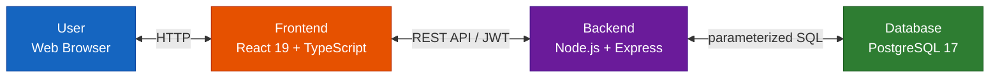
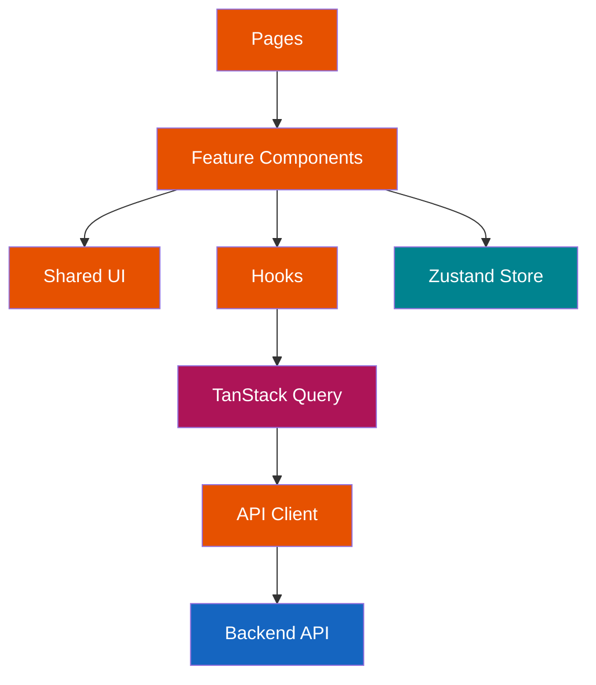
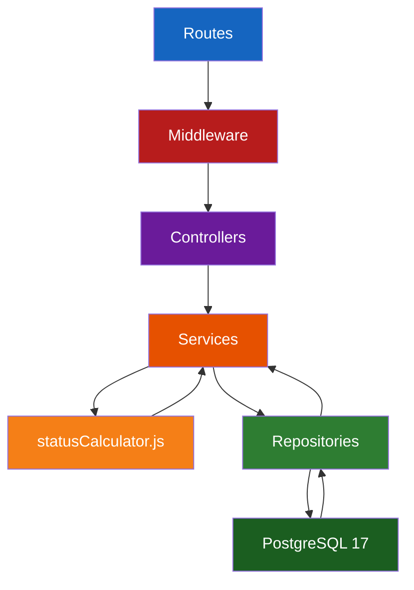
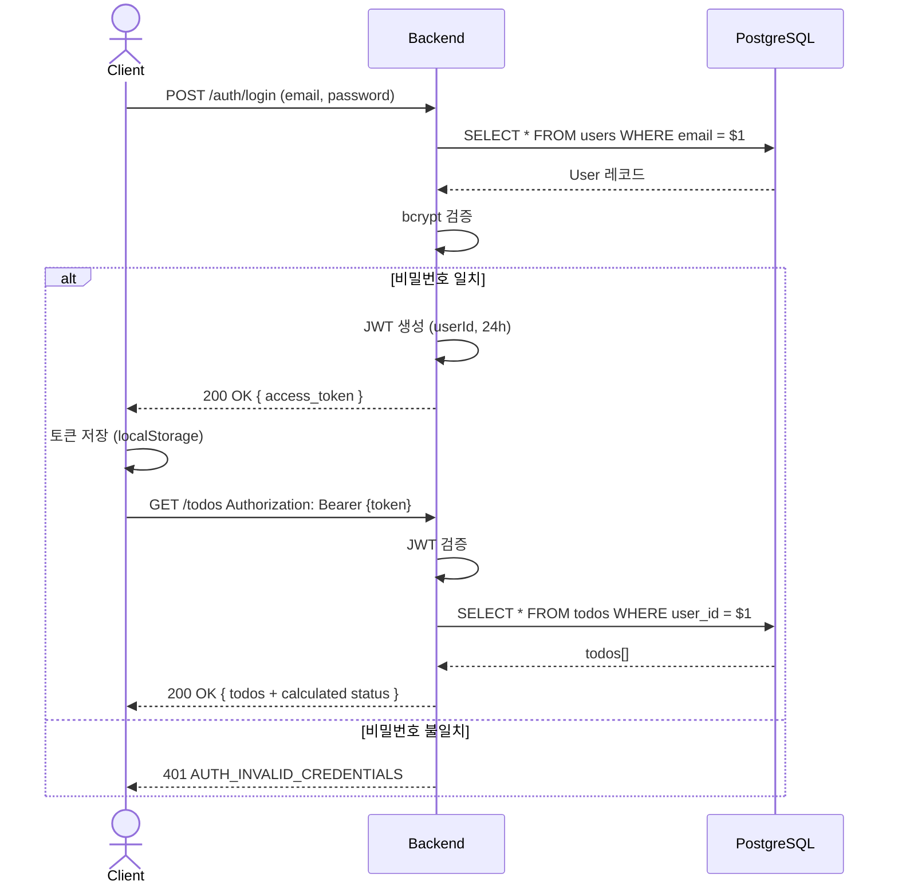

# TodoList 기술 아키텍처 다이어그램

**버전**: 1.0  
**작성일**: 2026-05-27  
**참조 문서**:

- docs/1-domain-definition.md (v2.1)
- docs/2-PRD.md (v2.1)
- docs/4-project-structure.md (v1.2)

---

## 변경 이력

| 버전 | 날짜       | 변경 내용                                                                           | 작성자 |
| ---- | ---------- | ----------------------------------------------------------------------------------- | ------ |
| 1.0  | 2026-05-27 | 최초 작성 (4개 섹션: 전체 시스템 구조, 프론트엔드 레이어, 백엔드 레이어, 인증 흐름) | -      |

---

## 섹션 1: 전체 시스템 구조 (C4 Context 수준)

사용자가 프론트엔드를 통해 백엔드 API에 요청하고, 백엔드가 데이터베이스를 조회하는 3-tier 아키텍처의 개요입니다.

---

## 섹션 2: 프론트엔드 레이어 구조

프론트엔드의 계층적 의존성: Pages → Feature Components → Hooks → API Client → Backend

---

## 섹션 3: 백엔드 레이어 구조

백엔드의 계층적 의존성: Routes → Controllers → Services → Repository → DB

---

## 섹션 4: 인증 흐름 (Sequence Diagram)

로그인 성공 후 JWT 발급, 보호된 API 호출 흐름입니다.

---

## 아키텍처 주요 특징

### 프론트엔드

- **상태 관리**: Zustand (전역 상태) + TanStack Query (서버 상태)
- **데이터 페칭**: TanStack Query의 Query/Mutation으로 캐싱 및 동기화
- **상태 계산**: 백엔드에서 계산된 상태를 그대로 사용 (재계산 금지)

### 백엔드

- **패턴**: Clean Architecture (Routes → Controllers → Services → Repository → DB)
- **상태 계산**: `statusCalculator.js`는 Service 레이어에서만 호출
- **보안**: Parameterized Query 필수 / JWT 인증 24시간 / bcrypt salt rounds 10+

### 데이터베이스

- **상태 저장**: 사용자 액션(`DONE`)만 저장
- **계산 상태**: `NOT_STARTED`, `IN_PROGRESS`, `OVERDUE`는 런타임에 계산
- **기본 카테고리**: 가입 시 자동 생성, 삭제 불가

---

## 보안 및 품질

| 항목          | 구현 사항                                  |
| ------------- | ------------------------------------------ |
| **인증**      | JWT (Access Token) 24시간 만료             |
| **권한**      | 사용자는 본인 데이터만 접근                |
| **암호화**    | bcrypt + salt rounds 10 이상               |
| **SQL 보안**  | Parameterized Query (`$1`, `$2`, ...) 필수 |
| **에러 처리** | 표준 오류 코드 및 메시지 형식 (19개 코드)  |
| **상태 관리** | 단일 출처 원칙 (statusCalculator.js)       |

---

## 다음 참조

- 사용자 시나리오: `docs/3-user-scenarios.md`
- 프로젝트 구조: `docs/4-project-structure.md`
- 도메인 규칙: `docs/1-domain-definition.md`
- 제품 요구사항: `docs/2-PRD.md`
