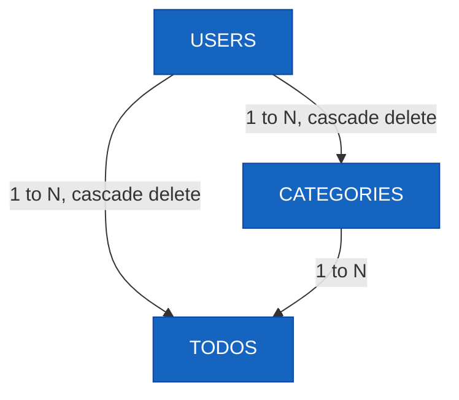

# ERD (Entity Relationship Diagram)

버전: 1.0  
작성일: 2026-05-27  
참조 문서: [docs/1-domain-definition.md](./1-domain-definition.md) (v2.1)

---

## 변경 이력

| 버전 | 날짜 | 변경 내용 | 작성자 |
|------|------|-----------|--------|
| 1.0 | 2026-05-27 | 최초 작성 - users, categories, todos 엔티티 및 관계 정의 | - |

---

## 1. Entity Relationship Diagram



### 관계 설명

| 관계 | 설명 | 삭제 정책 |
|------|------|-----------|
| USERS 1 ─── N CATEGORIES | 사용자가 여러 카테고리를 소유함 | CASCADE DELETE: 사용자 삭제 시 모든 카테고리 삭제 |
| USERS 1 ─── N TODOS | 사용자가 여러 할 일을 소유함 | CASCADE DELETE: 사용자 삭제 시 모든 할 일 삭제 |
| CATEGORIES 1 ─── N TODOS | 카테고리에 여러 할 일이 속함 | NO CASCADE: 카테고리 삭제 시 todos는 기본 카테고리로 이동 |

---

## 2. 엔티티 컬럼 상세

### 2.1 USERS 테이블

| 컬럼명 | 데이터 타입 | 제약 조건 | 설명 |
|--------|-----------|---------|------|
| `id` | UUID | PRIMARY KEY | 고유 식별자 |
| `email` | VARCHAR(255) | UNIQUE, NOT NULL | 로그인 ID 및 사용자 이메일 (시스템 전체에서 고유) |
| `password` | VARCHAR(255) | NOT NULL | bcrypt 해시된 비밀번호 (8~128자) |
| `name` | VARCHAR(50) | NOT NULL | 사용자 이름 (1~50자) |
| `theme` | VARCHAR(10) | NOT NULL, DEFAULT 'LIGHT' | UI 테마 설정 (`LIGHT` \| `DARK`) |
| `language` | VARCHAR(5) | NOT NULL, DEFAULT 'ko' | 언어 설정 (`ko` \| `en`) |
| `created_at` | TIMESTAMPTZ | NOT NULL | 가입일시 (UTC) |
| `updated_at` | TIMESTAMPTZ | NOT NULL | 수정일시 (UTC) |

**비즈니스 규칙 (도메인 정의서 참조)**
- R-AUTH-04: `email`은 시스템 내 고유하며, 중복 가입 불가
- R-AUTH-06: 비밀번호는 8자 이상 128자 이하, 영문자·숫자 각 1자 이상 포함
- R-SET-02: `theme` 기본값은 `LIGHT`
- R-SET-04: `language` 기본값은 `ko`

---

### 2.2 CATEGORIES 테이블

| 컬럼명 | 데이터 타입 | 제약 조건 | 설명 |
|--------|-----------|---------|------|
| `id` | UUID | PRIMARY KEY | 고유 식별자 |
| `user_id` | UUID | FOREIGN KEY → USERS(id), NOT NULL | 카테고리 소유자 (CASCADE DELETE) |
| `name` | VARCHAR(30) | NOT NULL | 카테고리명 (1~30자) |
| `is_default` | BOOLEAN | NOT NULL, DEFAULT false | 기본 카테고리 여부 |
| `created_at` | TIMESTAMPTZ | NOT NULL | 생성일시 (UTC) |
| `updated_at` | TIMESTAMPTZ | NOT NULL | 수정일시 (UTC) |

**비즈니스 규칙 (도메인 정의서 참조)**
- R-CAT-01: 할 일 등록 시 카테고리 미지정 → `기본` 카테고리 자동 적용
- R-CAT-02: `is_default = true`인 카테고리는 수정·삭제 불가
- R-CAT-03: 사용자는 자신이 소유한 카테고리만 조회·사용 가능
- R-CAT-04: 사용자 정의 카테고리 삭제 시 → todos는 기본 카테고리로 이동 (CASCADE DELETE 아님)
- R-CAT-05: 동일 `user_id` 내에서 `name`은 대소문자 무구분으로 유일성 강제 (예: "Work", "work" 중복 불가)

**인덱스 권장사항**
- UNIQUE INDEX: `(user_id, LOWER(name))` — 대소문자 무구분 유일성 보장

---

### 2.3 TODOS 테이블

| 컬럼명 | 데이터 타입 | 제약 조건 | 설명 |
|--------|-----------|---------|------|
| `id` | UUID | PRIMARY KEY | 고유 식별자 |
| `user_id` | UUID | FOREIGN KEY → USERS(id), NOT NULL | 할 일 소유자 (CASCADE DELETE) |
| `category_id` | UUID | FOREIGN KEY → CATEGORIES(id), NOT NULL | 소속 카테고리 |
| `title` | VARCHAR(100) | NOT NULL | 할 일 제목 (1~100자) |
| `description` | TEXT | NULL | 상세 내용 (최대 1000자) |
| `status` | VARCHAR(10) | NULL | 상태 코드: `DONE` 또는 NULL (미완료) |
| `start_date` | DATE | NULL | 시작일 (선택) |
| `end_date` | DATE | NULL | 종료일 (선택) |
| `created_at` | TIMESTAMPTZ | NOT NULL | 등록일시 (UTC) |
| `updated_at` | TIMESTAMPTZ | NOT NULL | 수정일시 (UTC) |

**비즈니스 규칙 (도메인 정의서 참조)**
- R-TODO-01: 사용자는 자신이 등록한 할 일만 조회·수정·삭제 가능
- R-TODO-02: `end_date >= start_date` (종료일이 시작일보다 이전 불가)
- R-TODO-03: `start_date`와 `end_date`는 선택 사항
- R-TODO-04: 완료(`DONE`) 상태도 수정·삭제 가능
- R-TODO-05: `title` 필수, 1~100자
- R-TODO-06: `description` 선택, 최대 1000자
- R-STA-01 ~ R-STA-04: `status` 값은 DB에 `DONE` 또는 NULL만 저장. `NOT_STARTED`, `IN_PROGRESS`, `OVERDUE`는 서버 런타임에 날짜 기준으로 계산함

**인덱스 권장사항**
- INDEX: `(user_id, category_id)` — 사용자별·카테고리별 조회 성능
- INDEX: `(user_id, status)` — 상태별 필터링 성능
- INDEX: `(category_id)` — 카테고리 삭제 시 고아 todos 찾기 성능

---

## 3. 비즈니스 규칙 요약

### 3.1 상태 저장 규칙

| 구분 | 상태 | DB 저장 | 설명 |
|------|------|--------|------|
| 사용자 액션 | `DONE` | ✓ | 사용자가 명시적으로 완료 처리한 경우만 저장 |
| 런타임 계산 | `NOT_STARTED` | ✗ | 시작일 이후 또는 진행 중 아님 → 서버에서 계산 |
| 런타임 계산 | `IN_PROGRESS` | ✗ | 시작일 <= 오늘 <= 종료일 → 서버에서 계산 |
| 런타임 계산 | `OVERDUE` | ✗ | 종료일 < 오늘 && status ≠ DONE → 서버에서 계산 |

> **주석**: `status` 컬럼은 NULL 또는 'DONE' 값만 가짐. 기타 상태는 클라이언트/서버 런타임에서 날짜 기반으로 계산.

### 3.2 데이터 무결성 규칙

| 규칙 | 설명 |
|------|------|
| **이메일 고유성** | `users.email`은 시스템 전체에서 유일 |
| **카테고리명 중복** | 동일 사용자(`user_id`) 내에서 `categories.name`은 대소문자 무구분으로 유일 |
| **기본 카테고리 보호** | `is_default = true`인 카테고리는 수정·삭제 불가 |
| **날짜 순서** | `todos.end_date >= todos.start_date` |
| **카스케이드 삭제** | 사용자 삭제 → 모든 카테고리와 할 일 자동 삭제 |
| **카테고리 이동** | 카테고리 삭제 → 그 카테고리의 todos는 해당 사용자의 기본 카테고리로 이동 |

### 3.3 기본값 규칙

| 엔티티 | 컬럼 | 기본값 | 설명 |
|--------|------|--------|------|
| USERS | `theme` | `LIGHT` | 신규 가입 시 자동 적용 |
| USERS | `language` | `ko` | 신규 가입 시 자동 적용 |
| CATEGORIES | `is_default` | `false` | 사용자 정의 카테고리는 기본값 false |
| CATEGORIES | (생성 시) | - | 사용자 가입 시 `name='기본'`, `is_default=true` 카테고리 자동 생성 |
| TODOS | `status` | NULL | 할 일 등록 시 NULL (미완료 상태) |

---

## 4. 인덱스 전략 (성능 최적화)

### 4.1 필수 인덱스

| 테이블 | 인덱스 이름 | 컬럼 | 용도 | 우선순위 |
|--------|-----------|------|------|---------|
| USERS | pk_users_id | `id` | 기본 키 (자동) | P0 |
| USERS | uk_users_email | `email` | 이메일 고유성 (자동) | P0 |
| CATEGORIES | pk_categories_id | `id` | 기본 키 (자동) | P0 |
| CATEGORIES | fk_categories_user_id | `user_id` | 사용자별 카테고리 조회 | P1 |
| CATEGORIES | uk_categories_user_name | `(user_id, LOWER(name))` | 카테고리명 대소문자 무구분 유일성 | P0 |
| TODOS | pk_todos_id | `id` | 기본 키 (자동) | P0 |
| TODOS | fk_todos_user_id | `user_id` | 사용자별 할 일 조회 | P1 |
| TODOS | fk_todos_category_id | `category_id` | 카테고리별 할 일 조회 및 고아 todos 처리 | P1 |
| TODOS | idx_todos_user_status | `(user_id, status)` | 사용자별·상태별 필터링 | P1 |
| TODOS | idx_todos_dates | `(user_id, start_date, end_date)` | 날짜 기반 상태 계산 성능 | P2 |

### 4.2 고려 사항

- **대소문자 무구분 카테고리명**: CATEGORIES에서 `(user_id, LOWER(name))`로 데이터베이스 함수 인덱스 사용
- **날짜 범위 쿼리**: TODOS의 `start_date`, `end_date` 범위 조회 시 복합 인덱스 권장
- **상태별 필터링**: `(user_id, status)` 복합 인덱스로 사용자별·상태별 목록 조회 최적화

---

## 5. 스키마 생성 및 관리 가이드

### 5.1 제약 조건 정의 순서

1. **테이블 생성** (PK, 컬럼 정의)
2. **FOREIGN KEY 제약** 생성 (CASCADE DELETE 설정)
3. **UNIQUE 제약** 생성 (이메일, 카테고리명)
4. **CHECK 제약** (선택) — 예: `end_date >= start_date`
5. **인덱스** 생성 (조회 성능)

### 5.2 CASCADE DELETE 적용

```
USERS (1)
  ├─ CATEGORIES (N) → DELETE CASCADE
  └─ TODOS (N) → DELETE CASCADE

CATEGORIES (1)
  └─ TODOS (N) → (NO CASCADE, UPDATE to default)
```

> **주의**: 카테고리 삭제 시 todos는 cascade delete하지 않음. 대신 해당 사용자의 기본 카테고리로 이동시키는 애플리케이션 로직 필요.

---

## 6. 데이터 정규화 및 일관성

### 6.1 정규화 수준

- **제1정규형 (1NF)**: 모든 속성이 원자성(Atomic) 보유 ✓
- **제2정규형 (2NF)**: 모든 non-key 속성이 PK에 완전 종속 ✓
- **제3정규형 (3NF)**: 모든 non-key 속성이 PK에만 종속 (이행 종속성 제거) ✓

### 6.2 트랜잭션 고려사항

| 작업 | 권장 트랜잭션 처리 |
|------|-----------------|
| 사용자 회원가입 | 1) USER 생성 → 2) 기본 CATEGORY 생성 (원자성 보장) |
| 할 일 등록 | 1) TODO 생성 → 2) 참조 무결성 확인 |
| 카테고리 삭제 | 1) 해당 TODOS를 기본 카테고리로 UPDATE → 2) CATEGORY 삭제 |
| 사용자 탈퇴 | CASCADE DELETE로 자동 처리 (DB 레벨) |

---

## 7. 타임스탐프 관리

모든 엔티티는 다음 타임스탐프를 관리:

| 컬럼 | 타입 | 설명 |
|------|------|------|
| `created_at` | TIMESTAMPTZ | 레코드 생성일시 (UTC) — 변경 불가 |
| `updated_at` | TIMESTAMPTZ | 마지막 수정일시 (UTC) — 매 업데이트 시 갱신 |

> **권장**: 데이터베이스 레벨에서 `updated_at`의 자동 갱신 트리거(TRIGGER) 설정 또는 애플리케이션 레벨에서 명시적 갱신

---

## 8. 참고 사항

### 8.1 관련 도메인 규칙

이 ERD는 다음 도메인 규칙들을 구현:

- **R-AUTH-05**: 회원 탈퇴 시 모든 카테고리와 할 일 CASCADE DELETE
- **R-CAT-01 ~ R-CAT-05**: 카테고리 관리 규칙 (기본 카테고리 보호, 대소문자 무구분 이름 중복 불가)
- **R-TODO-01 ~ R-TODO-06**: 할 일 관리 규칙 (제목·설명 길이, 날짜 순서)
- **R-STA-01 ~ R-STA-04**: 상태 전이 규칙 (런타임 계산, DB에는 DONE만 저장)
- **R-SET-01 ~ R-SET-05**: 사용자 설정 규칙 (테마, 언어)

### 8.2 다음 문서 참조

- [1-domain-definition.md](./1-domain-definition.md): 엔티티 정의 및 도메인 규칙 원본
- [2-PRD.md](./2-PRD.md): 제품 요구사항 정의
- [3-user-scenarios.md](./3-user-scenarios.md): 사용자 시나리오
- [5-arch-diagram.md](./5-arch-diagram.md): 아키텍처 다이어그램

---

**ERD 작성 완료**: 2026-05-27
