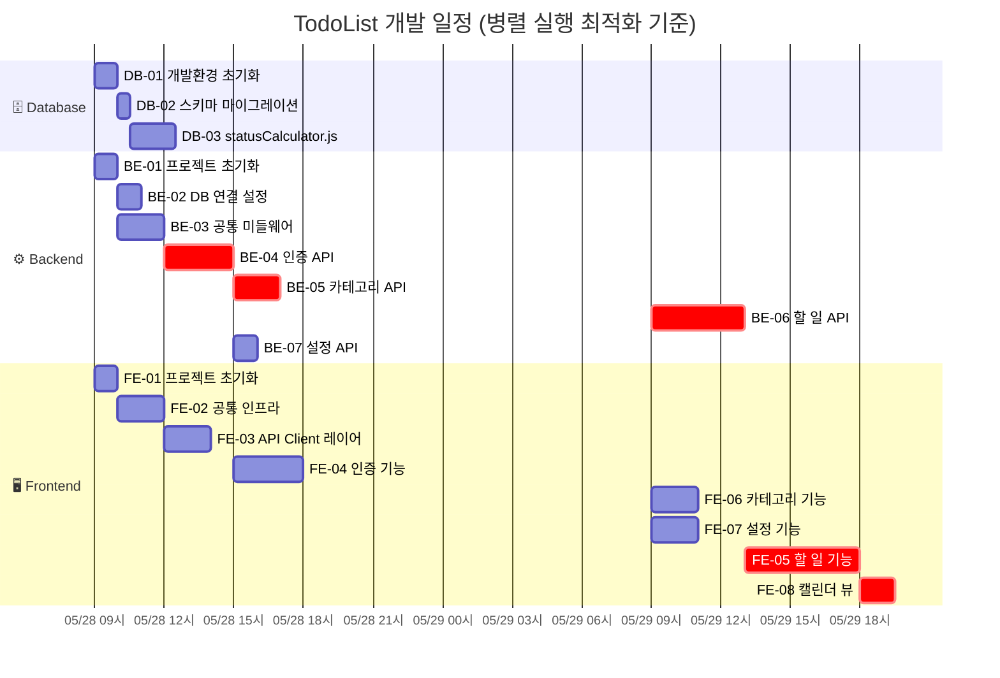

# TodoList 실행계획서

**버전**: 1.3  
**작성일**: 2026-05-28  
**참조 문서**: docs/1-domain-definition.md (v2.1), docs/2-PRD.md (v2.2), docs/4-project-structure.md (v1.2)

---

## 변경 이력

| 버전 | 날짜       | 변경 내용                                                                                                                      | 작성자 |
| ---- | ---------- | ------------------------------------------------------------------------------------------------------------------------------ | ------ |
| 1.0  | 2026-05-28 | 최초 작성                                                                                                                      | -      |
| 1.1  | 2026-05-28 | Gantt 차트 및 일자별 일정 추가, 와이어프레임 참조 반영                                                                         | -      |
| 1.2  | 2026-05-28 | 캘린더 뷰 FE-08 Task 추가, 월별 달력 일정표 추가, 구현 사실 반영 (auth.js 파일명, accessToken 필드명, GET /users/me 응답 필드) | -      |
| 1.3  | 2026-05-28 | FE-02 완료 체크, FE-03 API Client fetch → axios 인터셉터 방식으로 업데이트                                                     | -      |

---

## 읽는 법

- 각 Task의 **완료 조건**을 만족해야 다음 단계로 진행한다.
- **의존성**에 명시된 Task가 완료되지 않으면 해당 Task를 시작하지 않는다.
- 의존성이 없는 Task는 병렬 진행 가능하다.
- 체크박스 상태: `[ ]` 미완료 · `[x]` 완료

---

## 전체 Task 목록

| Task ID | 영역     | 이름                     | 의존성              |
| ------- | -------- | ------------------------ | ------------------- |
| DB-01   | Database | 개발 환경 초기화         | 없음                |
| DB-02   | Database | 스키마 마이그레이션 적용 | DB-01               |
| DB-03   | Database | statusCalculator.js 구현 | DB-02               |
| BE-01   | Backend  | 프로젝트 초기화          | 없음                |
| BE-02   | Backend  | DB 연결 설정             | DB-01, BE-01        |
| BE-03   | Backend  | 공통 미들웨어 구현       | BE-01               |
| BE-04   | Backend  | 인증 API 구현            | DB-02, BE-02, BE-03 |
| BE-05   | Backend  | 카테고리 API 구현        | BE-04               |
| BE-06   | Backend  | 할 일 API 구현           | DB-03, BE-04, BE-05 |
| BE-07   | Backend  | 설정 API 구현            | BE-04               |
| FE-01   | Frontend | 프로젝트 초기화          | 없음                |
| FE-02   | Frontend | 공통 인프라 구성         | FE-01               |
| FE-03   | Frontend | API Client 레이어 구현   | FE-02               |
| FE-04   | Frontend | 인증 기능 구현           | FE-03, BE-04        |
| FE-05   | Frontend | 할 일 기능 구현          | FE-04, BE-06        |
| FE-06   | Frontend | 카테고리 기능 구현       | FE-04, BE-05        |
| FE-07   | Frontend | 설정 기능 구현           | FE-04, BE-07        |
| FE-08   | Frontend | 캘린더 뷰 구현           | FE-05, BE-06        |

---

## 📅 전체 일정 개요

### 예상 소요 요약

| 영역     | Task 수 | 총 소요 시간        |
| -------- | ------- | ------------------- |
| Database | 3       | 3.5시간             |
| Backend  | 7       | 14시간              |
| Frontend | 8       | 18.5시간            |
| **합계** | **18**  | **36시간 (약 2일)** |

> 병렬 실행 시 크리티컬 패스 기준 약 18.5시간 = 약 2개 작업일

### 📆 월별 달력 일정표 (2026년 5월)

```
2026년 5월 개발 일정

     일    월    화    수    목    금    토
                                   1     2
 3     4     5     6     7     8     9
10    11    12    13    14    15    16
17    18    19    20    21    22    23
24    25    26    27   [28]  [29]  [30]
31
```

| 날짜             | 요일 | 주요 Task                                                                                    | 완료 예정      |
| ---------------- | ---- | -------------------------------------------------------------------------------------------- | -------------- |
| **28일** [1일차] | 목   | DB-01, BE-01, FE-01 → DB-02, BE-02, BE-03, FE-02 → DB-03, BE-04, FE-03 → BE-05, BE-07, FE-04 | Phase 1~4 완료 |
| **29일** [2일차] | 금   | BE-06, FE-06, FE-07 → FE-05 → FE-08                                                          | 전체 완료      |

> `[28]`, `[29]`: 개발 작업일 (오늘 = 28일 기준)
> 크리티컬 패스: BE-01 → BE-03 → BE-04 → BE-05 → BE-06 → FE-05 → FE-08 (18.5시간)

### Gantt 차트



### 크리티컬 패스

크리티컬 패스(`:crit` 표시): **BE-01 → BE-03 → BE-04 → BE-05 → BE-06 → FE-05 → FE-08**

총 크리티컬 패스 소요: 1 + 2 + 3 + 2 + 4 + 5 + 1.5 = **18.5시간 (2개 작업일)**

### 일자별 일정

| 날짜          | Phase     | 진행 Task                                       | 완료 예정                  |
| ------------- | --------- | ----------------------------------------------- | -------------------------- |
| 05/28 (목) AM | Phase 1+2 | DB-01, BE-01, FE-01, DB-02, BE-02, BE-03, FE-02 | Phase 1 완료, Phase 2 완료 |
| 05/28 (목) PM | Phase 3+4 | DB-03, BE-04, FE-03, BE-05, BE-07, FE-04        | Phase 3 완료, Phase 4 완료 |
| 05/29 (금) AM | Phase 5   | BE-06, FE-06, FE-07                             | BE-06, FE-06, FE-07 완료   |
| 05/29 (금) PM | Phase 5   | FE-05, FE-08                                    | 전체 완료                  |

---

## Phase 1 — 기반 구성 (병렬 진행 가능)

> DB-01, BE-01, FE-01은 의존성 없음 → 동시에 시작 가능

---

## 🗄️ Database Tasks

---

### DB-01: 개발 환경 초기화

**의존성**: 없음  
**예상 소요**: 1시간

#### 작업 목록

- [x] PostgreSQL 17 로컬 인스턴스 실행 확인
- [x] `todolist` 데이터베이스 생성
- [x] `.env` 파일 생성 (`DATABASE_URL`, `JWT_SECRET`, `PORT=3000`, `NODE_ENV=development`, `BCRYPT_SALT_ROUNDS=10`, `CORS_ORIGIN=http://localhost:5173`)
- [x] `.env.example` 파일 작성 (실제 값 제외)
- [x] `.gitignore`에 `.env` 추가 확인

#### 완료 조건

- [x] `psql -d todolist` 접속 성공
- [x] `.env` 파일이 git에 포함되지 않음
- [x] `DATABASE_URL` 연결 문자열로 pg 라이브러리 연결 테스트 통과

---

### DB-02: 스키마 마이그레이션 적용

**의존성**: DB-01  
**예상 소요**: 30분

#### 작업 목록

- [x] `database/schema.sql` 검토 (users, categories, todos 테이블)
- [x] `psql -d todolist -f database/schema.sql` 실행
- [x] `migrations/001_init.sql` 파일로 복사 (마이그레이션 이력 관리)
- [x] `scripts/migrate.js` Node.js 실행 스크립트 작성 (Windows 호환)

#### 완료 조건

- [x] 3개 테이블 (`users`, `categories`, `todos`) 생성 확인
- [x] 7개 인덱스 생성 확인 (`uk_categories_user_name` LOWER 함수 인덱스 포함)
- [x] 3개 `updated_at` 트리거 동작 확인 (UPDATE 후 `updated_at` 변경 검증)
- [x] CHECK 제약 조건 동작 확인 (`status`, `theme`, `language`, `dates`)

---

### DB-03: statusCalculator.js 구현

**의존성**: DB-02  
**예상 소요**: 2시간

#### 작업 목록

- [x] `backend/src/utils/statusCalculator.js` 파일 생성
- [x] `calculateStatus(todo, now)` 함수 구현 — `now`를 인자로 받아 테스트 가능하게 작성
- [x] 4가지 상태 계산 로직 구현:
  - `DONE`: `status === 'DONE'`
  - `IN_PROGRESS`: `startDate <= today <= endDate`
  - `OVERDUE`: `today > endDate && status !== 'DONE'`
  - `NOT_STARTED`: 그 외 (날짜 없음 포함)
- [x] 날짜 엣지 케이스 처리:
  - [x] 날짜 없음 → `NOT_STARTED`
  - [x] 시작일만 있음 → IN_PROGRESS/NOT_STARTED (OVERDUE 없음)
  - [x] 종료일만 있음 → OVERDUE/NOT_STARTED (IN_PROGRESS 없음)
  - [x] 시작일=종료일 → 당일 IN_PROGRESS, 익일 OVERDUE

#### 완료 조건

- [x] 모든 날짜 조합 단위 테스트 통과 (최소 8개 케이스)
- [x] `now` 인자 주입으로 특정 날짜 기준 테스트 가능
- [x] `DONE` 상태는 날짜 무관하게 항상 `DONE` 반환

---

## ⚙️ Backend Tasks

---

### BE-01: 프로젝트 초기화

**의존성**: 없음  
**예상 소요**: 1시간

#### 작업 목록

- [x] `backend/` 디렉토리 생성
- [x] `npm init -y` 실행
- [x] 의존성 설치: `express`, `pg`, `bcrypt`, `jsonwebtoken`, `dotenv`, `cors`
- [x] 개발 의존성 설치: `nodemon`, `jest` (또는 `vitest`)
- [x] 디렉토리 구조 생성:
  ```
  backend/src/
  ├── config/
  ├── middleware/
  ├── routes/
  ├── controllers/
  ├── services/
  ├── repositories/
  └── utils/
  ```
- [x] `backend/src/app.js` 기본 Express 앱 작성 (포트 3000)
- [x] `package.json` scripts 설정: `start`, `dev` (nodemon), `test`

#### 완료 조건

- [x] `npm run dev` 실행 후 `http://localhost:3000/health` → `200 OK` 응답
- [x] 디렉토리 구조가 `docs/4-project-structure.md`와 일치

---

### BE-02: DB 연결 설정

**의존성**: DB-01, BE-01  
**예상 소요**: 1시간

#### 작업 목록

- [x] `backend/src/config/db.js` 작성 — pg Pool 설정
- [x] `DATABASE_URL` 환경변수 기반 연결 (`.env` 로드)
- [x] `backend/src/config/env.js` 작성 — 필수 환경변수 검증 (없으면 서버 시작 실패)
- [x] DB 연결 실패 시 서버 시작 거부 처리

#### 완료 조건

- [x] `db.query('SELECT 1')` 성공
- [x] `DATABASE_URL` 누락 시 서버 시작 시 명확한 오류 메시지 출력 후 종료
- [x] Pool 객체가 `config/db.js`에서만 export되어 다른 파일에서 import 가능

---

### BE-03: 공통 미들웨어 구현

**의존성**: BE-01  
**예상 소요**: 2시간

#### 작업 목록

- [x] `middleware/auth.js` — JWT 검증 미들웨어
  - [x] `Authorization: Bearer {token}` 헤더 파싱
  - [x] 토큰 없음 → `401 AUTH_REQUIRED`
  - [x] 토큰 만료/위조 → `401 AUTH_TOKEN_EXPIRED` / `AUTH_TOKEN_INVALID`
  - [x] 유효 시 `req.userId` 주입
- [x] `middleware/errorHandler.js` — 전역 오류 핸들러
  - [x] 표준 오류 응답 형식: `{ "error": { "code": "...", "message": "..." } }`
  - [x] 알 수 없는 오류 → `500 INTERNAL_ERROR` (스택 트레이스는 개발 환경에서만 노출)
- [x] `middleware/validate.js` — 입력 검증 미들웨어 (선택: express-validator 또는 수동)
- [x] `utils/jwtUtils.js` — `signToken`, `verifyToken` 함수
- [x] `utils/passwordUtils.js` — `hashPassword`, `comparePassword` 함수 (bcrypt, salt rounds env)

#### 완료 조건

- [x] 유효한 JWT로 보호된 라우트 접근 시 `req.userId` 설정됨
- [x] 만료된 JWT → `401` 응답
- [x] 존재하지 않는 라우트 → `404` 응답
- [x] 처리되지 않은 오류 → `500` 응답 (스택 트레이스 미노출)

---

### BE-04: 인증 API 구현

**의존성**: DB-02, BE-02, BE-03  
**예상 소요**: 3시간

#### 작업 목록

- [x] **회원가입** `POST /auth/register`
  - [x] 이메일 형식 검증
  - [x] 비밀번호 규칙: 8~128자, 영문+숫자 포함 (`AUTH_PASSWORD_WEAK`)
  - [x] 이메일 중복 확인 (`AUTH_EMAIL_DUPLICATE` 409)
  - [x] bcrypt 해싱 후 저장
  - [x] 트랜잭션: users INSERT + "기본" 카테고리 INSERT 동시 처리
  - [x] 응답: `201 { data: { id, email, name } }`
- [x] **로그인** `POST /auth/login`
  - [x] 이메일 조회 후 bcrypt 비교
  - [x] 불일치 → `401 AUTH_INVALID_CREDENTIALS`
  - [x] JWT 생성 (payload: `{ userId }`, 24시간 만료)
  - [x] 응답: `200 { data: { accessToken } }`
- [x] **내 정보 조회** `GET /users/me` (인증 필요)
  - [x] `req.userId`로 users 조회
  - [x] 응답: `200 { data: { id, email, name, theme, language, createdAt, updatedAt } }`
- [x] **프로필 수정** `PATCH /users/me` (인증 필요)
  - [x] 이름 또는 비밀번호만 수정 가능 (이메일 변경 불가)
  - [x] 비밀번호 수정 시 bcrypt 재해싱
- [x] **회원 탈퇴** `DELETE /users/me` (인증 필요)
  - [x] users DELETE → CASCADE로 categories, todos 자동 삭제

#### 완료 조건

- [x] `POST /auth/register` 성공 시 `users` + `categories(기본)` 동시 생성
- [x] 중복 이메일 등록 → `409` 응답
- [x] 약한 비밀번호 → `400 AUTH_PASSWORD_WEAK`
- [x] 로그인 성공 → JWT 발급, 실패 → `401`
- [x] `GET /users/me` 토큰 없이 호출 → `401`

---

### BE-05: 카테고리 API 구현

**의존성**: BE-04  
**예상 소요**: 2시간

#### 작업 목록

- [x] **카테고리 목록 조회** `GET /categories` (인증 필요)
  - [x] `req.userId`의 카테고리만 반환
- [x] **카테고리 생성** `POST /categories` (인증 필요)
  - [x] 이름 1~30자 검증
  - [x] 동일 사용자 내 대소문자 무시 중복 확인 (`CATEGORY_NAME_DUPLICATE` 409)
- [x] **카테고리 수정** `PATCH /categories/:id` (인증 필요)
  - [x] 기본 카테고리 수정 시도 → `400 CATEGORY_DEFAULT_IMMUTABLE`
  - [x] 타인 카테고리 수정 → `403 FORBIDDEN`
- [x] **카테고리 삭제** `DELETE /categories/:id` (인증 필요)
  - [x] 기본 카테고리 삭제 시도 → `400 CATEGORY_DEFAULT_IMMUTABLE`
  - [x] 삭제 전 해당 카테고리의 todos → 기본 카테고리로 `category_id` 업데이트 (트랜잭션)
  - [x] 타인 카테고리 삭제 → `403 FORBIDDEN`

#### 완료 조건

- [x] 카테고리 삭제 시 todos가 기본 카테고리로 자동 이동됨
- [x] 기본 카테고리(`is_default=true`) 수정/삭제 시 `400` 응답
- [x] 타인 카테고리에 CRUD 시도 → `403` 응답
- [x] 동명 카테고리 생성 시 `409` 응답 (대소문자 무시)

---

### BE-06: 할 일 API 구현

**의존성**: DB-03, BE-04, BE-05  
**예상 소요**: 4시간

#### 작업 목록

- [x] **할 일 목록 조회** `GET /todos` (인증 필요)
  - [x] `req.userId`의 todos만 조회
  - [x] 쿼리 파라미터: `?status=NOT_STARTED|IN_PROGRESS|DONE|OVERDUE&categoryId=UUID`
  - [x] AND 조건 필터링
  - [x] 각 todo에 `statusCalculator.js`로 런타임 상태 계산 후 응답에 포함
- [x] **할 일 등록** `POST /todos` (인증 필요)
  - [x] 제목 필수, 1~100자 (`TODO_TITLE_TOO_LONG` 400)
  - [x] `categoryId` 미전달 시 기본 카테고리 자동 사용
  - [x] `startDate`, `endDate` 선택 — `endDate >= startDate` 검증
  - [x] 응답에 계산된 status 포함
- [x] **할 일 수정** `PATCH /todos/:id` (인증 필요)
  - [x] 타인 todo 수정 → `403 FORBIDDEN`
  - [x] 존재하지 않는 todo → `404 TODO_NOT_FOUND`
  - [x] 응답에 계산된 status 포함
- [x] **할 일 삭제** `DELETE /todos/:id` (인증 필요)
  - [x] 타인 todo 삭제 → `403 FORBIDDEN`
- [x] **완료 처리** `PATCH /todos/:id/complete` (인증 필요)
  - [x] `status = 'DONE'` 저장
- [x] **완료 취소** `PATCH /todos/:id/incomplete` (인증 필요)
  - [x] `status = NULL` 저장 → 날짜 기준으로 재계산된 상태 응답

#### 완료 조건

- [x] `GET /todos?status=OVERDUE` → 오늘 기준 OVERDUE todo만 반환
- [x] `GET /todos?status=IN_PROGRESS&categoryId=UUID` → AND 조건 필터 동작
- [x] todo 등록/수정/조회 응답에 `status` 필드 항상 포함 (4가지 값 중 하나)
- [x] 완료 취소 후 날짜 기준 상태 재계산 확인
- [x] 타인 todo CRUD → `403`
- [x] 존재하지 않는 todo → `404`

---

### BE-07: 설정 API 구현

**의존성**: BE-04  
**예상 소요**: 1시간

#### 작업 목록

- [x] **테마 변경** `PATCH /users/me/settings`
  - [x] `{ theme: 'LIGHT' | 'DARK' }` 입력 검증
  - [x] `users.theme` 업데이트
- [x] **언어 변경** — 동일 엔드포인트에 `{ language: 'ko' | 'en' }` 포함
  - [x] `users.language` 업데이트
- [x] (선택) `GET /users/me`에 `theme`, `language` 포함 여부 확인 (이미 포함되어 있으면 별도 엔드포인트 불필요)

#### 완료 조건

- [x] `PATCH /users/me/settings { theme: 'DARK' }` → DB 반영 확인
- [x] `PATCH /users/me/settings { language: 'en' }` → DB 반영 확인
- [x] 허용되지 않은 값 입력 → `400` 응답

---

## 🖥️ Frontend Tasks

---

### FE-01: 프로젝트 초기화

**의존성**: 없음  
**예상 소요**: 1시간

#### 작업 목록

- [x] `npm create vite@latest frontend -- --template react-ts` 실행
- [x] 의존성 설치: `zustand`, `@tanstack/react-query`, `react-router-dom`, `i18next`, `react-i18next`
- [x] `frontend/.env` 생성: `VITE_API_BASE_URL=http://localhost:3000`
- [x] `frontend/.env.example` 생성
- [x] TypeScript strict mode 설정 (`tsconfig.json`)
- [x] 절대 경로 alias 설정 (`@/` → `src/`)
- [x] 디렉토리 구조 생성:
  ```
  frontend/src/
  ├── features/
  │   ├── auth/
  │   ├── todos/
  │   ├── categories/
  │   └── settings/
  ├── components/ui/
  ├── hooks/
  ├── store/
  ├── pages/
  ├── types/
  ├── constants/
  ├── utils/
  ├── router.tsx
  └── lib/
  ```

#### 완료 조건

- [x] `npm run dev` 실행 후 `http://localhost:5173` 접속 성공
- [x] TypeScript 컴파일 오류 없음
- [x] `@/` 경로 alias 동작 확인

---

### FE-02: 공통 인프라 구성

**의존성**: FE-01  
**예상 소요**: 2시간

#### 작업 목록

- [x] **Zustand store** (`store/authStore.ts`)
  - [x] `accessToken`, `userId` 상태
  - [x] `setToken`, `clearToken` 액션
  - [x] localStorage 연동 (persist)
- [x] **TanStack Query 설정** (`lib/queryClient.ts`)
  - [x] `QueryClient` 생성 (staleTime, retry 설정)
  - [x] `QueryClientProvider`를 `main.tsx`에 적용
- [x] **React Router 설정** (`router.tsx`)
  - [x] `PrivateRoute` 컴포넌트 — Zustand store에서 토큰 확인, 없으면 `/login` 리다이렉트
  - [x] 라우트 정의: `/login`, `/register`, `/todos`, `/categories`, `/settings`
- [x] **i18n 설정** (`lib/i18n.ts`)
  - [x] `ko`, `en` 기본 네임스페이스 생성
  - [x] 브라우저 언어 감지 (미지원 시 `ko` 기본)
- [x] **공통 타입 정의** (`types/index.ts`)
  - [x] `User`, `Todo`, `Category`, `TodoStatus` 타입
  - [x] API 응답 래퍼 타입 `ApiResponse<T>`, `ApiError`
- [x] Apple Design Tokens CSS 변수 정의 (`color-blue`, `color-green`, `color-red`, `color-orange`, `bg-*`, `text-*`, `radius-*`, `spacing-*`)
- [x] 다크 모드 CSS 변수 (`@media prefers-color-scheme: dark`)
- [x] SF Pro 폰트 스택 설정 (`-apple-system`, `BlinkMacSystemFont`, `'SF Pro Display'`)

#### 완료 조건

- [x] 토큰 없이 `/todos` 접근 시 `/login`으로 리다이렉트
- [x] 토큰 있을 때 `/login` 접근 시 `/todos`로 리다이렉트
- [x] `QueryClientProvider` 정상 적용 (React Query DevTools 확인)
- [x] `useTranslation` 훅으로 `t('key')` 호출 가능

---

### FE-03: API Client 레이어 구현

**의존성**: FE-02  
**예상 소요**: 2시간

#### 작업 목록

- [x] `lib/apiClient.ts` — axios 인스턴스 + 인터셉터
  - [x] `VITE_API_BASE_URL` 기반 baseURL 설정
  - [x] 요청 인터셉터: `Authorization: Bearer {token}` 헤더 자동 주입
  - [x] 응답 인터셉터: `401` 시 `clearToken()` + `/login` 리다이렉트
  - [x] 응답 언래핑: `{ data: T }` → `T`, 에러 시 `error.code` 추출
- [x] `features/auth/api.ts` — 인증 API 함수
- [x] `features/todos/api.ts` — 할 일 API 함수
- [x] `features/categories/api.ts` — 카테고리 API 함수
- [x] `features/settings/api.ts` — 설정 API 함수

#### 완료 조건

- [x] 유효한 토큰으로 API 호출 시 정상 응답
- [x] 만료된 토큰으로 API 호출 시 로그아웃 처리됨
- [x] 네트워크 오류 시 적절한 오류 객체 반환
- [x] `VITE_API_BASE_URL` 변경만으로 API 서버 전환 가능

---

### FE-04: 인증 기능 구현

**참조 와이어프레임**: WF-01(로그인), WF-02(회원가입), WF-07(프로필)

**의존성**: FE-03, BE-04  
**예상 소요**: 3시간

#### 작업 목록

- [x] Floating Label 입력 컴포넌트 (포커스 시 레이블 위로 spring 애니메이션)
- [x] Center Card 반응형 레이아웃 (≥768px 480px 고정폭, <768px 풀너비 + 16px 패딩)
- [x] **회원가입 페이지** (`pages/RegisterPage.tsx`)
  - [x] 이메일, 비밀번호, 이름 입력 폼
  - [x] 클라이언트 사이드 검증 (비밀번호 규칙 안내)
  - [x] 성공 시 자동 로그인 또는 `/login`으로 이동
  - [x] `AUTH_EMAIL_DUPLICATE` → 이메일 중복 안내 메시지
- [x] **로그인 페이지** (`pages/LoginPage.tsx`)
  - [x] 이메일, 비밀번호 입력 폼
  - [x] 성공 시 토큰 저장 (Zustand) → `/todos` 이동
  - [x] `AUTH_INVALID_CREDENTIALS` → 오류 메시지 표시
- [x] **로그아웃**
  - [x] 토큰 클리어 후 `/login` 이동 (서버 요청 불필요)
- [x] **프로필 수정** (`features/auth/ProfileForm.tsx`)
  - [x] 이름, 비밀번호 수정 폼 (이메일 수정 필드 없음)

#### 완료 조건

- [x] 회원가입 → 자동 로그인 → `/todos` 이동
- [x] 잘못된 자격증명 로그인 → 오류 메시지 표시 (로딩 상태 포함)
- [x] 로그아웃 후 보호된 라우트 접근 시 `/login` 리다이렉트
- [x] 브라우저 새로고침 후 로그인 상태 유지 (localStorage persist)

---

### FE-05: 할 일 기능 구현

**참조 와이어프레임**: WF-03(할 일 목록), WF-04(등록/수정 모달)

**의존성**: FE-04, BE-06  
**예상 소요**: 5시간

#### 작업 목록

- [x] Segmented Control 필터 컴포넌트 (상태 4종, pill 형태)
- [x] 모바일 Bottom Sheet 컴포넌트 (Modal 컴포넌트가 반응형으로 Bottom Sheet 겸용)
- [x] 데스크톱 Center Modal 컴포넌트 (blur 딤 오버레이 + radius-xl 카드)
- [x] Skeleton 로딩 카드 컴포넌트
- [x] Empty State 컴포넌트 (아이콘 + 제목 + CTA)
- [x] **할 일 목록 페이지** (`pages/TodosPage.tsx`)
  - [x] TanStack Query로 `GET /todos` 조회 및 캐싱
  - [x] 상태 필터 UI (NOT_STARTED / IN_PROGRESS / DONE / OVERDUE)
  - [x] 카테고리 필터 UI (드롭다운)
  - [x] 필터 AND 조건 적용
- [x] **할 일 카드 컴포넌트** (`features/todos/TodoCard.tsx`)
  - [x] 상태 배지 색상 구분 (상태별 색상 정의)
  - [x] 완료/취소 토글 버튼
  - [x] 수정/삭제 버튼
- [x] **할 일 등록 폼** (`features/todos/TodoForm.tsx`)
  - [x] 제목(필수), 설명(선택), 카테고리 선택, 시작일/종료일 선택
  - [x] 종료일 < 시작일 선택 불가 처리
  - [x] TanStack Query Mutation으로 등록 후 목록 캐시 무효화
- [x] **할 일 수정 폼** — TodoForm 재사용 (todo prop으로 구분)
- [x] **할 일 삭제** — window.confirm 다이얼로그 후 삭제
- [x] **완료 처리/취소** — useMutation + invalidateQueries

#### 완료 조건

- [x] 할 일 등록 후 목록에 즉시 반영 (캐시 무효화)
- [x] 상태 필터 변경 시 목록 즉시 갱신
- [x] 완료 처리 후 상태가 `DONE`으로 변경됨
- [x] `TODO_TITLE_TOO_LONG` → 클라이언트에서 사전 차단 (Zod max 100)
- [x] 백엔드가 계산한 `status` 값을 그대로 표시 (프론트 재계산 없음)

---

### FE-06: 카테고리 기능 구현

**참조 와이어프레임**: WF-05(카테고리 관리)

**의존성**: FE-04, BE-05  
**예상 소요**: 2시간

#### 작업 목록

- [x] 인라인 편집 폼 컴포넌트 (항목 위치에서 바로 편집)
- [x] 삭제 확인 다이얼로그 (기본 카테고리로 이동 안내 포함)
- [x] **카테고리 목록** (`pages/CategoriesPage.tsx` 또는 설정 내 섹션)
  - [x] 카테고리 목록 조회
  - [x] 기본 카테고리는 수정/삭제 버튼 비활성화
- [x] **카테고리 생성 폼**
  - [x] 이름 1~30자 검증
  - [x] `CATEGORY_NAME_DUPLICATE` → 중복 안내
- [x] **카테고리 수정**
  - [x] 이름 수정 (기본 카테고리 제외)
- [x] **카테고리 삭제**
  - [x] 삭제 시 "해당 카테고리의 할 일이 기본으로 이동됩니다" 안내 다이얼로그
  - [x] 삭제 후 할 일 목록 캐시 무효화

#### 완료 조건

- [x] 카테고리 삭제 후 해당 todos가 기본 카테고리로 이동됨 (목록 갱신 확인)
- [x] 기본 카테고리 수정/삭제 버튼 UI에서 비활성화
- [x] 동명 카테고리 생성 시 `409` 응답 후 오류 메시지 표시

---

### FE-07: 설정 기능 구현

**참조 와이어프레임**: WF-06(설정), WF-07(프로필)

**의존성**: FE-04, BE-07  
**예상 소요**: 2시간

#### 작업 목록

- [x] iOS 스타일 Toggle Switch 컴포넌트 (32×20px, System Blue/회색)
- [x] Grouped Settings List 레이아웃 (섹션별 Inset Grouped List)
- [x] **설정 페이지** (`pages/SettingsPage.tsx`)
  - [x] 테마 전환 토글 (LIGHT/DARK) — 낙관적 업데이트 적용
  - [x] 언어 선택 드롭다운 (ko/en) — 변경 즉시 i18n 적용
- [x] **테마 적용**
  - [x] CSS 변수로 테마 전환 (`[data-theme]` 선택자, PrivateRoute useEffect)
- [x] **언어 적용**
  - [x] `i18next.changeLanguage()` 호출
  - [x] 변경된 언어 서버 저장 (DB 동기화)

#### 완료 조건

- [x] 테마 변경 즉시 UI 반영 (서버 응답 대기 없이 낙관적 업데이트)
- [x] 언어 변경 시 모든 UI 텍스트 즉시 전환
- [x] 새로고침 후에도 설정 유지 (DB 저장 확인)
- [x] 허용되지 않은 테마/언어 값 전송 → `400` 응답

---

### FE-08: 캘린더 뷰 구현

**참조 와이어프레임**: WF-08 (캘린더 뷰)

**의존성**: FE-05, BE-06  
**예상 소요**: 1.5시간

#### 작업 목록

- [x] `pages/CalendarPage.tsx` 생성
- [x] `features/calendar/CalendarGrid.tsx` — 7열×5행 월별 그리드
  - [x] 각 셀: 날짜 숫자 + 할 일 dot indicator (최대 3개, 초과 시 "+N")
  - [x] 오늘 날짜: System Blue 외곽선 원 강조
  - [x] 상태별 dot 색상: DONE=green, IN_PROGRESS=blue, OVERDUE=red, NOT_STARTED=gray
- [x] `features/calendar/DayDetail.tsx` — 선택된 날짜 할 일 목록
  - [x] 데스크톱: 우측 패널 (Inset Grouped List)
  - [x] 모바일: Bottom Sheet (spring 400ms, grabber handle)
- [x] `features/calendar/api.ts` — TanStack Query로 월별 데이터 조회
  - [x] `GET /todos?dueDateFrom=YYYY-MM-01&dueDateTo=YYYY-MM-31`
- [x] 월 이동 (← →) — 달력 슬라이드 전환 spring 250ms
- [x] Router에 `/calendar` 경로 추가 (PrivateRoute)
- [x] 데스크톱 Sidebar / 모바일 TabBar에 "캘린더" 탭 추가

#### 완료 조건

- [x] 월별 달력 그리드 정상 렌더링 (7열 × 5행)
- [x] end_date 기준으로 해당 날짜 셀에 dot 표시
- [x] 날짜 탭/클릭 시 해당 날짜 할 일 목록 표시
- [x] 월 이동 시 API 재호출 및 달력 업데이트
- [x] 오늘 날짜 진입 시 자동 선택 및 Day Detail 표시
- [x] 모바일 Bottom Sheet spring 애니메이션 정상 동작

---

## 실행 순서 요약 (Phase별)

```
Phase 1 (2026-05-28 오전, 병렬)
├── DB-01: 개발 환경 초기화
├── BE-01: 백엔드 프로젝트 초기화
└── FE-01: 프론트엔드 프로젝트 초기화

Phase 2 (2026-05-28 오전, 병렬)
├── DB-02: 스키마 마이그레이션 (DB-01 후)
├── BE-02: DB 연결 설정 (DB-01, BE-01 후)
├── BE-03: 공통 미들웨어 (BE-01 후)
└── FE-02: 공통 인프라 구성 (FE-01 후)

Phase 3 (2026-05-28 오후, 병렬)
├── DB-03: statusCalculator.js (DB-02 후)
├── BE-04: 인증 API (DB-02, BE-02, BE-03 후)
└── FE-03: API Client 레이어 (FE-02 후)

Phase 4 (2026-05-28 오후, 병렬)
├── BE-05: 카테고리 API (BE-04 후)
├── BE-07: 설정 API (BE-04 후)
├── FE-04: 인증 기능 (FE-03, BE-04 후)
└── DB-03 → BE-06 준비

Phase 5 (2026-05-29 종일, 병렬)
├── BE-06: 할 일 API (DB-03, BE-04, BE-05 후)
├── FE-05: 할 일 기능 (FE-04, BE-06 후)
├── FE-06: 카테고리 기능 (FE-04, BE-05 후)
├── FE-07: 설정 기능 (FE-04, BE-07 후)
└── FE-08: 캘린더 뷰 (FE-05, BE-06 후)
```

---

## 다음 참조

- 도메인 규칙: `docs/1-domain-definition.md`
- 제품 요구사항: `docs/2-PRD.md`
- 프로젝트 구조: `docs/4-project-structure.md`
- 기술 아키텍처: `docs/5-arch-diagram.md`
- ERD: `docs/6-erd.md`
- DB 스키마: `database/schema.sql`
- 와이어프레임: `docs/8-wireframes.md`
