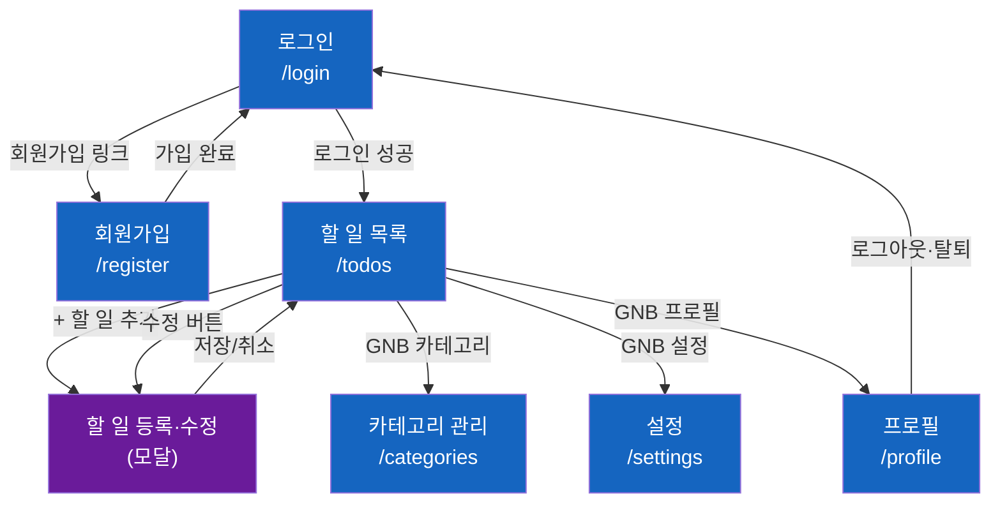

# TodoList 와이어프레임

**버전**: 1.0  
**작성일**: 2026-05-28  
**참조 문서**: docs/1-domain-definition.md (v2.1), docs/2-PRD.md (v2.1), docs/3-user-scenarios.md (v1.3), docs/4-project-structure.md (v1.2)

---

## 변경 이력

| 버전 | 날짜       | 변경 내용 | 작성자 |
| ---- | ---------- | --------- | ------ |
| 1.0  | 2026-05-28 | 최초 작성 | -      |

---

## 범례

```
┌─────┐  컨테이너/카드
│     │
└─────┘

[  버튼  ]   클릭 가능한 버튼

[____________]  텍스트 입력 필드

[v 드롭다운 v]  드롭다운 선택

( )  라디오 버튼    [x]  체크박스

●──○  토글 스위치 (● ON / ○ OFF)

≡   햄버거 메뉴

★   현재 활성 탭/메뉴
```

---

## 화면 전환 흐름



---

## 레이아웃 공통 원칙

- **Desktop** (≥ 768px): 좌측 사이드바(200px) + 우측 메인 콘텐츠
- **Mobile** (< 768px): 하단 탭 바 + 단일 컬럼
- **인증 화면** (`/login`, `/register`): 사이드바 없음, 중앙 카드 레이아웃
- 버튼 최소 터치 영역: 44 × 44px

---

## WF-01: 로그인 페이지 (`/login`)

### 데스크톱

```
┌──────────────────────────────────────────────────────────────┐
│                                                              │
│                    TodoList                                  │
│                                                              │
│              ┌────────────────────────────┐                  │
│              │                            │                  │
│              │  이메일                     │                  │
│              │  [__________________________]                 │
│              │                            │                  │
│              │  비밀번호                   │                  │
│              │  [__________________________]                 │
│              │                            │                  │
│              │  [       로그인         ]  │                  │
│              │                            │                  │
│              │  계정이 없으신가요? [회원가입]│                  │
│              │                            │                  │
│              └────────────────────────────┘                  │
│                                                              │
│                       [한국어 v]                              │
└──────────────────────────────────────────────────────────────┘
```

### 오류 상태

```
│  이메일                                                       │
│  [__________________________]                                │
│  비밀번호                                                     │
│  [__________________________]                                │
│  ┌─────────────────────────────────────────┐                 │
│  │ ⚠  이메일 또는 비밀번호가 올바르지 않습니다. │                 │
│  └─────────────────────────────────────────┘                 │
│  [       로그인         ]                                    │
```

### 인터랙션 노트

| 상황 | 동작 |
|------|------|
| 로그인 성공 | JWT 저장 → `/todos` 이동 |
| 이미 로그인됨 | 자동으로 `/todos` 리다이렉트 |
| 오류 `AUTH_INVALID_CREDENTIALS` | 인라인 오류 메시지 표시 (이메일 존재 여부 미노출) |
| 언어 선택 | 드롭다운 변경 시 즉시 UI 언어 전환 (저장 없음) |

---

## WF-02: 회원가입 페이지 (`/register`)

### 데스크톱

```
┌──────────────────────────────────────────────────────────────┐
│                                                              │
│                    TodoList                                  │
│                                                              │
│              ┌────────────────────────────┐                  │
│              │                            │                  │
│              │  이름                       │                  │
│              │  [__________________________]                 │
│              │                            │                  │
│              │  이메일                     │                  │
│              │  [__________________________]                 │
│              │                            │                  │
│              │  비밀번호                   │                  │
│              │  [__________________________]                 │
│              │  영문자와 숫자를 포함하여 8자 이상              │
│              │                            │                  │
│              │  [       회원가입        ]  │                  │
│              │                            │                  │
│              │  이미 계정이 있으신가요? [로그인]│               │
│              │                            │                  │
│              └────────────────────────────┘                  │
│                                                              │
└──────────────────────────────────────────────────────────────┘
```

### 필드 검증 상태

```
│  비밀번호                                                     │
│  [••••••• _________________]                                 │
│  ⚠  영문자와 숫자를 포함하여 8자 이상이어야 합니다.            │
                                                              
│  이메일                                                       │
│  [test@email.com___________]                                 │
│  ⚠  이미 사용 중인 이메일입니다.                               │
```

### 인터랙션 노트

| 상황 | 동작 |
|------|------|
| 가입 성공 | "기본" 카테고리 자동 생성 → `/login` 이동 |
| `AUTH_EMAIL_DUPLICATE` | 이메일 필드 아래 인라인 오류 |
| `AUTH_PASSWORD_WEAK` | 비밀번호 필드 아래 규칙 안내 |
| 비밀번호 실시간 검증 | 타이핑 중 규칙 충족 여부 표시 |

---

## WF-03: 할 일 목록 페이지 (`/todos`)

### 데스크톱 — 전체 레이아웃

```
┌──────────────────────────────────────────────────────────────┐
│  TodoList                              [프로필]  [설정]  [로그아웃] │
├──────────────┬───────────────────────────────────────────────┤
│              │                                               │
│  ★ 할 일     │  할 일 목록                  [ + 할 일 추가 ] │
│              │                                               │
│  카테고리     │  ┌─────────────────────────────────────────┐  │
│              │  │ 상태  [ 전체 v ] [ 카테고리 전체 v ]      │  │
│  설정         │  └─────────────────────────────────────────┘  │
│              │                                               │
│              │  ┌─────────────────────────────────────────┐  │
│              │  │ [x] 오늘 마감 리포트 작성        업무     │  │
│              │  │     ● DONE            ~2026-05-28       │  │
│              │  │                          [수정] [삭제]   │  │
│              │  ├─────────────────────────────────────────┤  │
│              │  │ [ ] API 명세서 검토              업무     │  │
│              │  │     ● IN_PROGRESS     2026-05-27~05-29  │  │
│              │  │                          [수정] [삭제]   │  │
│              │  ├─────────────────────────────────────────┤  │
│              │  │ [ ] 독서 30분              개인           │  │
│              │  │     ● OVERDUE         ~2026-05-25       │  │
│              │  │                          [수정] [삭제]   │  │
│              │  ├─────────────────────────────────────────┤  │
│              │  │ [ ] 운동 계획 세우기          기본        │  │
│              │  │     ● NOT_STARTED     2026-05-30~       │  │
│              │  │                          [수정] [삭제]   │  │
│              │  └─────────────────────────────────────────┘  │
│              │                                               │
└──────────────┴───────────────────────────────────────────────┘
```

### 상태 배지 색상

| 상태 | 배지 |
|------|------|
| `NOT_STARTED` | ○ 회색 — 시작 전 |
| `IN_PROGRESS` | ● 파란색 — 진행 중 |
| `OVERDUE` | ● 빨간색 — 기한 초과 |
| `DONE` | ● 초록색 — 완료 |

### 필터 영역 상세

```
  ┌─────────────────────────────────────────────────────────┐
  │  상태: [ 전체 v ]                카테고리: [ 전체 v ]   │
  │         ├ 전체                             ├ 전체        │
  │         ├ 시작 전                          ├ 기본        │
  │         ├ 진행 중                          ├ 업무        │
  │         ├ 기한 초과                        └ 개인        │
  │         └ 완료                                          │
  └─────────────────────────────────────────────────────────┘
```

### 할 일 카드 상세 (항목별)

```
┌─────────────────────────────────────────────────────────────┐
│  [ ]  API 명세서 검토                           업무        │
│       ● IN_PROGRESS   2026-05-27 ~ 2026-05-29              │
│       API 명세서를 검토하고 피드백을 정리한다.               │
│                                         [ 수정 ] [ 삭제 ]   │
└─────────────────────────────────────────────────────────────┘
```

- `[ ]` 클릭 → 완료 처리 (`DONE`) / `[x]` 클릭 → 완료 취소 (날짜 기반 상태 재계산)
- 설명이 없는 경우 설명 줄 미표시

### 빈 상태 (할 일 없음)

```
┌─────────────────────────────────────────────────────────────┐
│                                                             │
│              📋                                             │
│        등록된 할 일이 없습니다.                               │
│        [ + 첫 번째 할 일 추가 ]                              │
│                                                             │
└─────────────────────────────────────────────────────────────┘
```

### 필터 결과 없음

```
┌─────────────────────────────────────────────────────────────┐
│                                                             │
│        선택한 조건에 해당하는 할 일이 없습니다.               │
│        [ 필터 초기화 ]                                       │
│                                                             │
└─────────────────────────────────────────────────────────────┘
```

### 모바일 레이아웃

```
┌─────────────────────────────┐
│  TodoList           [≡]     │
├─────────────────────────────┤
│  상태 [ 전체 v ]  카테고리 [전체 v] │
├─────────────────────────────┤
│ [ ]  API 명세서 검토         │
│      ● IN_PROGRESS          │
│      2026-05-27~05-29  업무  │
│                [수정][삭제] │
├─────────────────────────────┤
│ [x]  마감 리포트 작성         │
│      ● DONE   ~05-28  업무  │
│                [수정][삭제] │
├─────────────────────────────┤
│                        [＋] │
├───────┬───────┬───────┬─────┤
│★할 일 │카테고리│ 설정  │프로필│
└───────┴───────┴───────┴─────┘
```

---

## WF-04: 할 일 등록 / 수정 모달

### 등록 모달

```
┌──────────────────────────────────────────────────────────────┐
│  ╔══════════════════════════════════════════════════════╗    │
│  ║  할 일 추가                                     [✕]  ║    │
│  ║                                                      ║    │
│  ║  제목 *                                              ║    │
│  ║  [____________________________________________]      ║    │
│  ║  0 / 100                                            ║    │
│  ║                                                      ║    │
│  ║  설명 (선택)                                          ║    │
│  ║  [____________________________________________]      ║    │
│  ║  [____________________________________________]      ║    │
│  ║  0 / 1000                                           ║    │
│  ║                                                      ║    │
│  ║  카테고리                                             ║    │
│  ║  [v 기본                                       v]   ║    │
│  ║                                                      ║    │
│  ║  시작일                     종료일                   ║    │
│  ║  [__________________]      [__________________]     ║    │
│  ║                                                      ║    │
│  ║                [ 취소 ]        [ 저장 ]              ║    │
│  ╚══════════════════════════════════════════════════════╝    │
└──────────────────────────────────────────────────────────────┘
```

### 수정 모달

```
│  ╔══════════════════════════════════════════════════════╗   │
│  ║  할 일 수정                                     [✕]  ║   │
│  ║                                                      ║   │
│  ║  제목 *                                              ║   │
│  ║  [API 명세서 검토____________________________]       ║   │
│  ║  8 / 100                                            ║   │
│  ║                                                      ║   │
│  ║  설명 (선택)                                          ║   │
│  ║  [API 명세서를 검토하고 피드백을 정리한다.____________]  ║   │
│  ║  [____________________________________________]      ║   │
│  ║  18 / 1000                                          ║   │
│  ║                                                      ║   │
│  ║  카테고리                                             ║   │
│  ║  [v 업무                                       v]   ║   │
│  ║                                                      ║   │
│  ║  시작일                     종료일                   ║   │
│  ║  [2026-05-27_________]      [2026-05-29_________]   ║   │
│  ║                                                      ║   │
│  ║                [ 취소 ]        [ 저장 ]              ║   │
│  ╚══════════════════════════════════════════════════════╝   │
```

### 날짜 검증 오류 상태

```
│  ║  시작일                     종료일                   ║   │
│  ║  [2026-05-29_________]      [2026-05-27_________]   ║   │
│  ║  ⚠  종료일은 시작일 이후여야 합니다.                   ║   │
```

### 삭제 확인 다이얼로그

```
│  ╔══════════════════════════════════╗   │
│  ║  할 일을 삭제하시겠습니까?         ║   │
│  ║                                  ║   │
│  ║  "API 명세서 검토"                ║   │
│  ║  삭제한 항목은 복구할 수 없습니다. ║   │
│  ║                                  ║   │
│  ║     [ 취소 ]    [ 삭제 ]          ║   │
│  ╚══════════════════════════════════╝   │
```

### 인터랙션 노트

| 상황 | 동작 |
|------|------|
| 제목 100자 초과 | 저장 버튼 비활성화 + 글자수 빨간색 표시 |
| 종료일 < 시작일 선택 | 저장 버튼 비활성화 + 인라인 오류 메시지 |
| 카테고리 미선택 | "기본" 카테고리 자동 적용 |
| 저장 성공 | 모달 닫힘 + 목록 즉시 갱신 |
| 배경 클릭 | 모달 닫힘 (변경사항 있을 경우 확인 다이얼로그) |

---

## WF-05: 카테고리 관리 페이지 (`/categories`)

### 데스크톱

```
┌──────────────────────────────────────────────────────────────┐
│  TodoList                              [프로필]  [설정]  [로그아웃] │
├──────────────┬───────────────────────────────────────────────┤
│              │                                               │
│  할 일        │  카테고리 관리                [ + 카테고리 추가 ]│
│              │                                               │
│  ★ 카테고리  │  ┌─────────────────────────────────────────┐  │
│              │  │  기본           (기본값 · 삭제 불가)      │  │
│  설정         │  │                          [ — ] [ — ]    │  │
│              │  ├─────────────────────────────────────────┤  │
│              │  │  업무                        할 일 5개   │  │
│              │  │                        [ 수정 ] [ 삭제 ] │  │
│              │  ├─────────────────────────────────────────┤  │
│              │  │  개인                        할 일 2개   │  │
│              │  │                        [ 수정 ] [ 삭제 ] │  │
│              │  └─────────────────────────────────────────┘  │
│              │                                               │
└──────────────┴───────────────────────────────────────────────┘
```

- 기본 카테고리 행의 `[ — ]` 버튼은 비활성화 처리 (흐리게 표시)

### 카테고리 추가 인라인 폼

```
  ┌─────────────────────────────────────────────────────────┐
  │  기본                              (기본값 · 삭제 불가)  │
  ├─────────────────────────────────────────────────────────┤
  │  업무                                      [ 수정 ] [ 삭제 ] │
  ├─────────────────────────────────────────────────────────┤
  │  ┌───────────────────────────┐  [ 추가 ]  [ 취소 ]     │
  │  │ 새 카테고리명_____________│                          │
  │  └───────────────────────────┘  0 / 30               │
  └─────────────────────────────────────────────────────────┘
```

### 카테고리 수정 인라인

```
  ├─────────────────────────────────────────────────────────┤
  │  ┌───────────────────────────┐  [ 저장 ]  [ 취소 ]     │
  │  │ 업무______________________ │                        │
  │  └───────────────────────────┘  2 / 30               │
  └─────────────────────────────────────────────────────────┘
```

### 카테고리 삭제 확인 다이얼로그

```
│  ╔══════════════════════════════════════════════╗   │
│  ║  카테고리를 삭제하시겠습니까?                   ║   │
│  ║                                               ║   │
│  ║  "업무"                                        ║   │
│  ║  이 카테고리의 할 일 5개가                      ║   │
│  ║  "기본" 카테고리로 이동됩니다.                  ║   │
│  ║                                               ║   │
│  ║       [ 취소 ]        [ 삭제 ]                 ║   │
│  ╚══════════════════════════════════════════════╝   │
```

### 인터랙션 노트

| 상황 | 동작 |
|------|------|
| `CATEGORY_NAME_DUPLICATE` | 인라인 "이미 존재하는 카테고리 이름입니다" |
| 30자 초과 | 추가/저장 버튼 비활성화 + 글자수 빨간색 표시 |
| 카테고리 삭제 | 해당 todos → "기본" 카테고리로 자동 이동 |
| 기본 카테고리 삭제 시도 | 버튼 자체가 비활성화 (클릭 불가) |

---

## WF-06: 설정 페이지 (`/settings`)

### 데스크톱

```
┌──────────────────────────────────────────────────────────────┐
│  TodoList                              [프로필]  [설정]  [로그아웃] │
├──────────────┬───────────────────────────────────────────────┤
│              │                                               │
│  할 일        │  설정                                         │
│              │                                               │
│  카테고리     │  ┌─────────────────────────────────────────┐  │
│              │  │  테마                                     │  │
│  ★ 설정      │  │  ●──○  다크 모드                          │  │
│              │  └─────────────────────────────────────────┘  │
│              │                                               │
│              │  ┌─────────────────────────────────────────┐  │
│              │  │  언어                                     │  │
│              │  │                                          │  │
│              │  │  (●) 한국어                              │  │
│              │  │  ( ) English                             │  │
│              │  └─────────────────────────────────────────┘  │
│              │                                               │
└──────────────┴───────────────────────────────────────────────┘
```

### 다크 모드 활성화 상태

```
  │  테마                                    │
  │  ○──●  다크 모드                         │
  │        저장 중...                        │
```

### 인터랙션 노트

| 상황 | 동작 |
|------|------|
| 테마 토글 클릭 | 낙관적 업데이트 → 즉시 UI 테마 전환 → 서버 저장 |
| 테마 저장 실패 | 이전 테마로 자동 롤백 + 토스트 오류 메시지 |
| 언어 라디오 선택 | 즉시 i18n 언어 전환 → 서버 저장 |
| 새로고침 후 | DB에서 불러온 theme/language 적용 |

---

## WF-07: 프로필 페이지 (`/profile`)

### 데스크톱

```
┌──────────────────────────────────────────────────────────────┐
│  TodoList                              [프로필]  [설정]  [로그아웃] │
├──────────────┬───────────────────────────────────────────────┤
│              │                                               │
│  할 일        │  프로필                                        │
│              │                                               │
│  카테고리     │  ┌─────────────────────────────────────────┐  │
│              │  │  이름                                     │  │
│  설정         │  │  [홍길동____________________________]    │  │
│              │  └─────────────────────────────────────────┘  │
│              │                                               │
│              │  ┌─────────────────────────────────────────┐  │
│              │  │  이메일 (변경 불가)                        │  │
│              │  │  hong@example.com                        │  │
│              │  └─────────────────────────────────────────┘  │
│              │                                               │
│              │  ┌─────────────────────────────────────────┐  │
│              │  │  비밀번호 변경                             │  │
│              │  │                                          │  │
│              │  │  현재 비밀번호                             │  │
│              │  │  [______________________________]        │  │
│              │  │                                          │  │
│              │  │  새 비밀번호                               │  │
│              │  │  [______________________________]        │  │
│              │  │  영문자와 숫자를 포함하여 8자 이상          │  │
│              │  └─────────────────────────────────────────┘  │
│              │                                               │
│              │              [ 변경사항 저장 ]                 │
│              │                                               │
│              │  ─────────────────────────────────────────   │
│              │                                               │
│              │              [ 회원 탈퇴 ]                    │
│              │                                               │
└──────────────┴───────────────────────────────────────────────┘
```

### 회원 탈퇴 확인 다이얼로그

```
│  ╔══════════════════════════════════════════════════════╗   │
│  ║  정말로 탈퇴하시겠습니까?                              ║   │
│  ║                                                      ║   │
│  ║  탈퇴 시 모든 할 일과 카테고리가                       ║   │
│  ║  영구적으로 삭제되며 복구할 수 없습니다.                ║   │
│  ║                                                      ║   │
│  ║  확인을 위해 비밀번호를 입력해 주세요.                  ║   │
│  ║  [______________________________]                    ║   │
│  ║                                                      ║   │
│  ║          [ 취소 ]      [ 탈퇴하기 ]                   ║   │
│  ╚══════════════════════════════════════════════════════╝   │
```

### 인터랙션 노트

| 상황 | 동작 |
|------|------|
| 이름만 수정 | 이름만 PATCH |
| 비밀번호만 수정 | 비밀번호만 PATCH |
| 이메일 필드 | read-only, 포커스 불가 |
| 탈퇴 성공 | 모든 데이터 삭제 → 로그인 화면 이동 |
| 탈퇴 비밀번호 불일치 | 다이얼로그 내 인라인 오류 메시지 |

---

## WF-08: 공통 컴포넌트

### Global Navigation Bar (GNB) — 데스크톱

```
┌──────────────────────────────────────────────────────────────┐
│  TodoList                [프로필 이름]  ⚙ 설정  → 로그아웃  │
└──────────────────────────────────────────────────────────────┘
```

### 사이드바 — 데스크톱

```
┌──────────────┐
│  TodoList    │
│              │
│  ★ 할 일    │  ← 현재 활성
│    카테고리  │
│    설정      │
│              │
└──────────────┘
```

### 하단 탭 바 — 모바일

```
┌───────┬───────┬───────┬───────┐
│★할 일 │카테고리│ 설정  │ 프로필│
└───────┴───────┴───────┴───────┘
```

### 토스트 알림

```
                ┌──────────────────────────────┐
                │  ✓  할 일이 저장되었습니다.   │  ← 우하단, 3초 후 사라짐
                └──────────────────────────────┘

                ┌──────────────────────────────┐
                │  ✕  저장에 실패했습니다.      │  ← 오류 토스트 (빨간색)
                └──────────────────────────────┘
```

### 로딩 상태

```
  ┌─────────────────────────────────────────────────────────┐
  │  ░░░░░░░░░░░░░░░░░░░░░░░░░░░░░░  (스켈레톤 카드)        │
  ├─────────────────────────────────────────────────────────┤
  │  ░░░░░░░░░░░░░░░░░░░░░░░                               │
  └─────────────────────────────────────────────────────────┘
```

---

## 화면별 API 매핑 요약

| 화면 | 진입 시 API | 사용자 액션 → API |
|------|------------|-------------------|
| WF-01 로그인 | — | `POST /auth/login` |
| WF-02 회원가입 | — | `POST /auth/register` |
| WF-03 할 일 목록 | `GET /todos`, `GET /categories` | 완료 토글: `PATCH /todos/:id/complete` or `/incomplete`<br>삭제: `DELETE /todos/:id` |
| WF-04 할 일 모달 | — | 등록: `POST /todos`<br>수정: `PATCH /todos/:id` |
| WF-05 카테고리 | `GET /categories` | 추가: `POST /categories`<br>수정: `PATCH /categories/:id`<br>삭제: `DELETE /categories/:id` |
| WF-06 설정 | `GET /users/me` | `PATCH /users/me/settings` |
| WF-07 프로필 | `GET /users/me` | 수정: `PATCH /users/me`<br>탈퇴: `DELETE /users/me` |

---

## 다음 참조

- 도메인 규칙: `docs/1-domain-definition.md`
- 사용자 시나리오: `docs/3-user-scenarios.md`
- 프로젝트 구조: `docs/4-project-structure.md`
- 기술 아키텍처: `docs/5-arch-diagram.md`
- 실행계획: `docs/7-execution-plan.md`
