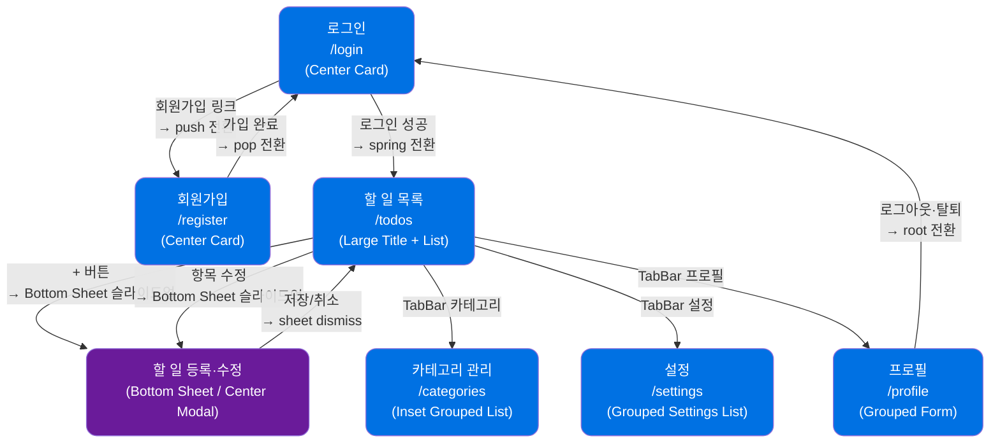

# TodoList 와이어프레임

**버전**: 1.1
**작성일**: 2026-05-28
**디자인 철학**: Apple Human Interface Guidelines (HIG) 반영
**참조 문서**: docs/1-domain-definition.md (v2.1), docs/2-PRD.md (v2.1), docs/3-user-scenarios.md (v1.3), docs/4-project-structure.md (v1.2)

---

## 변경 이력

| 버전 | 날짜       | 변경 내용                                      | 작성자 |
| ---- | ---------- | ---------------------------------------------- | ------ |
| 1.0  | 2026-05-28 | 최초 작성                                      | -      |
| 1.1  | 2026-05-28 | Apple HIG 디자인 철학 전면 반영, 디자인 토큰 추가 | -      |

---

## Apple Design Tokens

### 색상 팔레트

| 토큰명              | Light Mode  | Dark Mode   | 용도                        |
| ------------------- | ----------- | ----------- | --------------------------- |
| `color-blue`        | `#0071e3`   | `#0a84ff`   | System Blue, Primary CTA    |
| `color-green`       | `#28cd41`   | `#30d158`   | 완료 상태, 성공 피드백       |
| `color-red`         | `#ff3b30`   | `#ff453a`   | 삭제, 오류, Destructive 액션 |
| `color-orange`      | `#ff9500`   | `#ff9f0a`   | 기한 초과 경고, 주의         |
| `color-gray`        | `#8e8e93`   | `#636366`   | 비활성, 보조 텍스트          |
| `bg-primary`        | `#ffffff`   | `#000000`   | 주 배경                      |
| `bg-secondary`      | `#f5f5f7`   | `#1c1c1e`   | 섹션 배경, 카드 배경         |
| `bg-tertiary`       | `#ffffff`   | `#2c2c2e`   | 카드 내부, 입력 필드 배경    |
| `bg-grouped`        | `#f2f2f7`   | `#1c1c1e`   | Grouped List 배경            |
| `text-primary`      | `#1d1d1f`   | `#f5f5f7`   | 본문 텍스트                  |
| `text-secondary`    | `#86868b`   | `#ebebf5`   | 보조 텍스트, 힌트            |
| `text-tint`         | `#0071e3`   | `#0a84ff`   | 링크, Tint 버튼 텍스트       |
| `separator`         | `#c6c6c8`   | `#38383a`   | 구분선 (1px)                 |
| `overlay-blur`      | `rgba(255,255,255,0.72)` | `rgba(28,28,30,0.72)` | 반투명 블러 배경 |

### 타이포그래피

| 토큰명                 | 폰트                  | 크기  | 굵기      | 용도                    |
| ---------------------- | --------------------- | ----- | --------- | ----------------------- |
| `type-large-title`     | SF Pro Display        | 34pt  | Bold      | Large Title (진입 시)   |
| `type-title-1`         | SF Pro Display        | 28pt  | Bold      | 섹션 제목               |
| `type-title-2`         | SF Pro Display        | 22pt  | Bold      | 카드 제목               |
| `type-title-3`         | SF Pro Display        | 20pt  | Semibold  | 서브 섹션 제목          |
| `type-headline`        | SF Pro Text           | 17pt  | Semibold  | 항목 제목               |
| `type-body`            | SF Pro Text           | 17pt  | Regular   | 본문                    |
| `type-callout`         | SF Pro Text           | 16pt  | Regular   | 설명 텍스트             |
| `type-subheadline`     | SF Pro Text           | 15pt  | Regular   | 보조 정보               |
| `type-footnote`        | SF Pro Text           | 13pt  | Regular   | 메타 정보, 글자수       |
| `type-caption`         | SF Pro Text           | 12pt  | Regular   | 배지, 라벨              |
| `type-code`            | SF Mono               | 13pt  | Regular   | 코드, 날짜 (고정폭)     |

### 간격 및 Border Radius

| 토큰명           | 값       | 용도                          |
| ---------------- | -------- | ----------------------------- |
| `radius-sm`      | 8px      | 소형 배지, 태그               |
| `radius-md`      | 12px     | 입력 필드, 소형 카드          |
| `radius-lg`      | 16px     | Inset Grouped List 섹션       |
| `radius-xl`      | 20px     | 모달 카드, Bottom Sheet       |
| `radius-full`    | 9999px   | Pill 버튼, 토글, Search Bar   |
| `spacing-xs`     | 4px      | 요소 내부 미세 간격           |
| `spacing-sm`     | 8px      | 관련 요소 간격                |
| `spacing-md`     | 16px     | 기본 패딩, 섹션 내부 패딩     |
| `spacing-lg`     | 20px     | 섹션 간 간격                  |
| `spacing-xl`     | 32px     | 페이지 상단 여백              |
| `touch-target`   | 44×44px  | 최소 터치/클릭 영역           |

### 애니메이션

| 토큰명                  | 값                                   | 용도                       |
| ----------------------- | ------------------------------------ | -------------------------- |
| `spring-default`        | spring(0.4, 0, 0.2, 1) 300ms        | 기본 트랜지션              |
| `spring-sheet`          | spring(0.4, 0, 0.2, 1) 400ms        | Bottom Sheet 슬라이드업    |
| `spring-modal`          | spring(0.5, 0, 0.2, 1) 350ms        | Center Modal 등장          |
| `ease-toast`            | ease-out 250ms                       | Toast 슬라이드다운         |
| `ease-toggle`           | ease-in-out 200ms                    | 토글 스위치 전환           |
| `ease-context-menu`     | spring(0.3, 0, 0.2, 1) 280ms        | Context Menu 팝업          |

---

## 범례

```
╭─────╮  Inset Grouped List 섹션 (radius-lg)
│     │
╰─────╯

[────────────── 버튼 텍스트 ──────────────]   Primary CTA (pill, 풀너비)
[  취소  ]   Secondary 버튼 (tint)
[  삭제  ]   Destructive 버튼 (red)

(🔍 검색...                              ✕)   Search Bar (rounded-full)

◉   완료 항목 (System Green)
○   미완료 항목 (회색 테두리)

⬤ 완료     System Green 배지
⬤ 진행중   System Blue 배지
⬤ 초과     System Red 배지
⬤ 시작전   System Gray 배지

●──○  토글 ON (System Blue)
○──●  토글 OFF (회색)

     ━━━━━     Bottom Sheet grabber handle (4×36px pill, 상단 중앙)

← [삭제] | 항목 텍스트 →   스와이프 액션 표현

[전체] [진행중] [완료]   Segmented Control (pill 형태)

≡   사이드바 토글 (모바일)
⚙   설정 SF Symbol
←   뒤로가기 SF Symbol
＋   추가 SF Symbol
```

---

## 화면 전환 흐름



---

## 레이아웃 공통 원칙

- **Desktop / iPad** (≥ 768px): 좌측 Inset Sidebar (200px) + 우측 메인 콘텐츠. 선택 항목 파란 pill 하이라이트.
- **Mobile** (< 768px): 하단 TabBar 4탭 + 단일 컬럼. 현재 탭 System Blue, 미선택 회색.
- **인증 화면** (`/login`, `/register`): 사이드바/TabBar 없음, 중앙 카드 레이아웃. 블러 배경 오버레이.
- **Large Title**: 페이지 진입 시 34pt Bold 제목, 스크롤 시 NavigationBar inline 제목(17pt Semibold)으로 자동 전환.
- **NavigationBar**: 반투명(blur) 배경 (`bg-overlay-blur`), 스크롤 시 separator 노출.
- **터치 영역**: 모든 인터랙티브 요소 최소 44×44px 보장.

---

## WF-01: 로그인 페이지 (`/login`)

### 데스크톱

```
┌──────────────────────────────────────────────────────────────────┐
│                                                                  │
│                                                                  │
│                       TodoList                                   │
│                  (SF Pro Display 28pt Bold)                      │
│                                                                  │
│         ╭──────────────────────────────────────────╮            │
│         │                                          │            │
│         │   이메일                                  │            │
│         │   ╭────────────────────────────────────╮ │            │
│         │   │  user@example.com                  │ │            │
│         │   ╰────────────────────────────────────╯ │            │
│         │   (* Floating Label: 포커스 시 레이블      │            │
│         │      위로 이동, spring 200ms 애니메이션)   │            │
│         │                                          │            │
│         │   비밀번호                                │            │
│         │   ╭────────────────────────────────────╮ │            │
│         │   │  ••••••••                      [👁] │ │            │
│         │   ╰────────────────────────────────────╯ │            │
│         │                                          │            │
│         │   [────────────── 로그인 ──────────────]  │            │
│         │   (* System Blue bg, radius-full, 50px h)│            │
│         │                                          │            │
│         │       계정이 없으신가요?  [회원가입]        │            │
│         │       (* Tint Button, System Blue text)  │            │
│         │                                          │            │
│         ╰──────────────────────────────────────────╯            │
│         (* radius-xl 20px, bg-secondary 카드)                   │
│                                                                  │
│                     [한국어  ▾]                                  │
│               (* Tint Button, 언어 선택)                         │
│                                                                  │
└──────────────────────────────────────────────────────────────────┘
```

### 오류 상태 (인라인 피드백)

```
│   이메일                                                          │
│   ╭────────────────────────────────╮                             │
│   │  user@example.com              │  ← border: color-red       │
│   ╰────────────────────────────────╯                             │
│   비밀번호                                                        │
│   ╭────────────────────────────────╮                             │
│   │  ••••••••                 [👁] │  ← border: color-red       │
│   ╰────────────────────────────────╯                             │
│                                                                  │
│   ╭─────────────────────────────────────────────────────╮       │
│   │  ⚠  이메일 또는 비밀번호가 올바르지 않습니다.          │       │
│   │     (* color-red, footnote 13pt)                    │       │
│   ╰─────────────────────────────────────────────────────╯       │
│                                                                  │
│   [────────────── 로그인 ──────────────]                         │
```

### Apple HIG 적용 사항

| 패턴                  | 적용 내용                                                         |
| --------------------- | ----------------------------------------------------------------- |
| Center Modal 레이아웃 | radius-xl(20px) 카드, bg-secondary 배경, 블러 딤 효과             |
| Floating Label 입력   | 포커스 시 레이블 위로 이동, spring(0.4,0,0.2,1) 200ms 애니메이션  |
| Primary CTA           | 풀너비, 50px 높이, radius-full, System Blue 배경                  |
| Tint Button           | 회원가입 링크, System Blue 텍스트만                               |
| SF Symbol             | 비밀번호 보기/숨기기 eye 아이콘 (44×44px 터치 영역)               |

### 인터랙션 노트

| 상황                            | 동작                                                               |
| ------------------------------- | ------------------------------------------------------------------ |
| 로그인 성공                     | JWT 저장 → `/todos` spring 전환, 성공 haptic feedback (medium)     |
| 이미 로그인됨                   | 자동으로 `/todos` 리다이렉트                                       |
| 오류 `AUTH_INVALID_CREDENTIALS` | 인라인 오류 메시지 표시 (이메일 존재 여부 미노출), error haptic     |
| 언어 선택                       | 드롭다운 변경 시 즉시 UI 언어 전환 (서버 저장 없음)                |
| 버튼 로딩 중                    | 로그인 버튼 내 ActivityIndicator 표시, 버튼 비활성화               |

### 다크 모드 고려사항

- 카드 배경: `bg-tertiary` (`#2c2c2e`)
- 입력 필드 배경: `bg-secondary` (`#1c1c1e`)
- 텍스트: `text-primary` (`#f5f5f7`)
- 로그인 버튼: `color-blue` dark (`#0a84ff`)
- 오류 메시지: `color-red` dark (`#ff453a`)

---

## WF-02: 회원가입 페이지 (`/register`)

### 데스크톱

```
┌──────────────────────────────────────────────────────────────────┐
│                                                                  │
│                       TodoList                                   │
│                  (SF Pro Display 28pt Bold)                      │
│                                                                  │
│         ╭──────────────────────────────────────────╮            │
│         │                                          │            │
│         │   이름                                    │            │
│         │   ╭────────────────────────────────────╮ │            │
│         │   │  홍길동                             │ │            │
│         │   ╰────────────────────────────────────╯ │            │
│         │                                          │            │
│         │   이메일                                  │            │
│         │   ╭────────────────────────────────────╮ │            │
│         │   │  user@example.com                  │ │            │
│         │   ╰────────────────────────────────────╯ │            │
│         │                                          │            │
│         │   비밀번호                                │            │
│         │   ╭────────────────────────────────────╮ │            │
│         │   │  ••••••••                      [👁] │ │            │
│         │   ╰────────────────────────────────────╯ │            │
│         │   영문자와 숫자를 포함하여 8자 이상         │            │
│         │   (* footnote 13pt, text-secondary)      │            │
│         │                                          │            │
│         │   [──────────────── 회원가입 ───────────] │            │
│         │   (* System Blue bg, radius-full, 50px h)│            │
│         │                                          │            │
│         │    이미 계정이 있으신가요?  [로그인]        │            │
│         │    (* Tint Button, System Blue text)     │            │
│         │                                          │            │
│         ╰──────────────────────────────────────────╯            │
│         (* radius-xl 20px, bg-secondary 카드)                   │
│                                                                  │
└──────────────────────────────────────────────────────────────────┘
```

### 필드 검증 상태 (실시간)

```
│   비밀번호                                                        │
│   ╭────────────────────────────────────────╮                     │
│   │  ••••••                           [👁] │  ← border: orange  │
│   ╰────────────────────────────────────────╯                     │
│   ⚠  영문자와 숫자를 포함하여 8자 이상이어야 합니다.               │
│   (* color-orange, footnote 13pt, 실시간 표시)                   │
│                                                                  │
│   이메일                                                          │
│   ╭────────────────────────────────────────╮                     │
│   │  test@email.com                        │  ← border: red     │
│   ╰────────────────────────────────────────╯                     │
│   ⚠  이미 사용 중인 이메일입니다.                                  │
│   (* color-red, footnote 13pt)                                   │
```

### Apple HIG 적용 사항

| 패턴                  | 적용 내용                                                          |
| --------------------- | ------------------------------------------------------------------ |
| Floating Label 입력   | 모든 필드 포커스 시 레이블 위로 이동 애니메이션                     |
| 실시간 검증 피드백    | 타이핑 중 비밀번호 강도 즉시 표시 (색상 변화 + footnote 안내)      |
| Primary CTA 비활성화  | 검증 미통과 시 버튼 opacity 0.4, pointer-events: none              |
| SF Symbol 아이콘      | eye.fill / eye.slash.fill 비밀번호 토글 (44×44px 영역)            |

### 인터랙션 노트

| 상황                   | 동작                                                          |
| ---------------------- | ------------------------------------------------------------- |
| 가입 성공              | "기본" 카테고리 자동 생성 → `/login` 이동, success haptic     |
| `AUTH_EMAIL_DUPLICATE` | 이메일 필드 아래 인라인 오류, error haptic                    |
| `AUTH_PASSWORD_WEAK`   | 비밀번호 필드 아래 규칙 안내 (orange 경고)                    |
| 비밀번호 실시간 검증   | 타이핑 중 규칙 충족 여부 즉시 표시 (green ✓ / orange ⚠)      |
| 버튼 로딩 중           | 회원가입 버튼 내 ActivityIndicator, 버튼 비활성화             |

### 다크 모드 고려사항

- 입력 필드 테두리 오류 색상: `color-red` dark (`#ff453a`)
- 경고 색상: `color-orange` dark (`#ff9f0a`)
- 카드 내부 배경: `bg-tertiary` dark (`#2c2c2e`)

---

## WF-03: 할 일 목록 페이지 (`/todos`)

### 데스크톱 — 전체 레이아웃

```
┌──────────────────────────────────────────────────────────────────┐
│ [반투명 blur NavigationBar — bg-overlay-blur]                    │
│  TodoList                         [홍길동]  [⚙]  [→ 로그아웃]   │
│ (* inline 제목 17pt Semibold, 스크롤 시 표시)                    │
├────────────────────┬─────────────────────────────────────────────┤
│                    │                                             │
│  [Inset Sidebar]   │  할 일 목록                    [＋ 할 일]   │
│  (* blur bg)       │  (* Large Title 34pt Bold,      (* pill    │
│                    │     스크롤 시 inline 전환)         44px h)  │
│  ╭──────────────╮  │                                             │
│  │ ⬤ 할 일      │  │  (🔍 검색...                          ✕)   │
│  ╰──────────────╯  │  (* Search Bar, rounded-full)              │
│  (* 선택: blue pill│                                             │
│    highlight)      │  ┌──────────────────────────────────────┐  │
│                    │  │  [전체]  [시작전]  [진행중]  [완료]   │  │
│    카테고리        │  │  (* Segmented Control, pill 형태)     │  │
│    설정            │  └──────────────────────────────────────┘  │
│                    │                                             │
│                    │  [카테고리 전체  ▾]                         │
│                    │  (* Tint Button 드롭다운)                   │
│                    │                                             │
│                    │  ╭────────────────────────────────────────╮ │
│                    │  │                                        │ │
│                    │  │  ◉  오늘 마감 리포트 작성     업무      │ │
│                    │  │     ⬤ 완료  (* green)  ~2026-05-28    │ │
│                    │  │                       [수정]  [삭제]   │ │
│                    │  │ ─ ─ ─ ─ ─ ─ ─ ─ ─ ─ ─ ─ ─ ─ ─ ─ ─ ─ │ │
│                    │  │  (* separator 1px, 좌측 16px inset)   │ │
│                    │  │                                        │ │
│                    │  │  ○  API 명세서 검토           업무     │ │
│                    │  │     ⬤ 진행중  (* blue) 05-27~05-29   │ │
│                    │  │                       [수정]  [삭제]   │ │
│                    │  │ ─ ─ ─ ─ ─ ─ ─ ─ ─ ─ ─ ─ ─ ─ ─ ─ ─ ─ │ │
│                    │  │                                        │ │
│                    │  │  ○  독서 30분                 개인     │ │
│                    │  │     ⬤ 기한초과 (* red) ~2026-05-25   │ │
│                    │  │                       [수정]  [삭제]   │ │
│                    │  │ ─ ─ ─ ─ ─ ─ ─ ─ ─ ─ ─ ─ ─ ─ ─ ─ ─ ─ │ │
│                    │  │                                        │ │
│                    │  │  ○  운동 계획 세우기           기본    │ │
│                    │  │     ⬤ 시작전  (* gray) 2026-05-30~   │ │
│                    │  │                       [수정]  [삭제]   │ │
│                    │  │                                        │ │
│                    │  ╰────────────────────────────────────────╯ │
│                    │  (* Inset Grouped List, radius-lg 16px)    │
│                    │                                             │
└────────────────────┴─────────────────────────────────────────────┘
```

### 상태 배지 색상

| 상태          | 배지                                   | 색상 토큰       |
| ------------- | -------------------------------------- | --------------- |
| `NOT_STARTED` | ⬤ 시작전  `○` 체크 원형 (미완료)      | `color-gray`    |
| `IN_PROGRESS` | ⬤ 진행중  `○` 체크 원형 (미완료)      | `color-blue`    |
| `OVERDUE`     | ⬤ 기한초과 `○` 체크 원형 (미완료)     | `color-red`     |
| `DONE`        | ⬤ 완료    `◉` 체크 원형 (완료, 취소선) | `color-green`   |

### 할 일 카드 상세 (항목별)

```
╭────────────────────────────────────────────────────────────────╮
│                                                                │
│  ○  API 명세서 검토                                업무        │
│  (* 44px 터치 영역)  (* headline 17pt Semibold)  (* caption)  │
│     ⬤ 진행중   2026-05-27 ~ 2026-05-29                        │
│     (* blue badge)  (* footnote 13pt, SF Mono 날짜)           │
│     API 명세서를 검토하고 피드백을 정리한다.                    │
│     (* callout 16pt, text-secondary, 설명 없으면 미표시)       │
│                                        [ 수정 ]  [ 삭제 ]     │
│                                     (* tint)   (* destructive)│
╰────────────────────────────────────────────────────────────────╯
```

### 스와이프 액션 (모바일)

```
← [⬤ 삭제] | ○  API 명세서 검토  업무  →
  (* red bg   (* swipe left to reveal,
   white text   spring 애니메이션)
   44px h)
```

### Context Menu (항목 길게 누르기)

```
╭──────────────────────────────────────╮
│                                      │
│  ○  API 명세서 검토                  │
│  (* 블러 배경, 원본 항목 확대 표시)  │
│                                      │
╰──────────────────────────────────────╯
    ╭──────────────────────╮
    │   ✎  수정            │
    │ ─────────────────── │
    │   ◉  완료로 표시     │
    │ ─────────────────── │
    │   🗑  삭제           │  ← destructive (red)
    ╰──────────────────────╯
    (* radius-lg, blur 배경, spring 애니메이션)
```

### 빈 상태 (Empty State)

```
╭─────────────────────────────────────────────────────────────╮
│                                                             │
│                      📋                                     │
│              (* SF Symbol: checklist.unchecked, 60pt)      │
│                                                             │
│              등록된 할 일이 없습니다.                        │
│              (* title-2 22pt Bold)                         │
│                                                             │
│        할 일을 추가해서 오늘의 목표를 관리해 보세요.          │
│        (* body 17pt, text-secondary)                       │
│                                                             │
│         [──────── + 첫 번째 할 일 추가 ────────]            │
│         (* Primary CTA, System Blue, radius-full)          │
│                                                             │
╰─────────────────────────────────────────────────────────────╯
```

### 필터 결과 없음 (Empty State — Filter)

```
╭─────────────────────────────────────────────────────────────╮
│                                                             │
│                    🔍                                       │
│              (* SF Symbol: magnifyingglass, 60pt)          │
│                                                             │
│          선택한 조건에 맞는 할 일이 없습니다.                │
│          (* title-2 22pt Bold)                             │
│                                                             │
│         [──────── 필터 초기화 ────────]                     │
│         (* Secondary CTA, tint 텍스트)                     │
│                                                             │
╰─────────────────────────────────────────────────────────────╯
```

### 모바일 레이아웃

```
╔═════════════════════════════════╗
║  [← ]  할 일 목록          [＋] ║
║  (* blur NavigationBar)         ║
╠═════════════════════════════════╣
║  (🔍 검색...               ✕)  ║
║  (* Search Bar, rounded-full)   ║
╠═════════════════════════════════╣
║  [전체] [시작전] [진행중] [완료] ║
║  (* Segmented Control pill)     ║
╠═════════════════════════════════╣
║                                 ║
║  ← [⬤ 삭제] | ○  API 명세서    ║
║               검토     업무     ║
║               ⬤ 진행중         ║
║               05-27~05-29      ║
║  (* 스와이프 힌트 표시)         ║
╠─ ─ ─ ─ ─ ─ ─ ─ ─ ─ ─ ─ ─ ─ ─ ╣
║  (* separator 1px, 16px inset) ║
║                                 ║
║  ◉  마감 리포트 작성    업무    ║
║     ⬤ 완료  ~05-28             ║
║     (* 취소선 적용)             ║
╠═════════════════════════════════╣
║  (* TabBar — blur 배경)         ║
║  ⬤할일  카테고리  설정  프로필  ║
║  (* blue  gray    gray  gray)  ║
╚═════════════════════════════════╝
```

### Apple HIG 적용 사항

| 패턴                    | 적용 내용                                                          |
| ----------------------- | ------------------------------------------------------------------ |
| Large Title             | 34pt Bold, 스크롤 시 NavigationBar inline 17pt Semibold 자동 전환  |
| NavigationBar blur      | 반투명 blur 배경, 스크롤 시 separator 노출                         |
| Inset Grouped List      | radius-lg(16px) 섹션, bg-secondary 배경                           |
| Segmented Control       | 상태 필터를 pill 형태 세그먼트 컨트롤로                             |
| Search Bar              | rounded-full, 돋보기 좌측, 취소 버튼 우측                          |
| Swipe Actions (모바일)  | 좌측 스와이프 → 빨간 삭제 트레이 (spring 애니메이션)               |
| Context Menu            | 길게 누르기 → blur 배경 + 팝업 메뉴 (spring 애니메이션)            |
| TabBar (모바일)         | 하단 4탭, blur 배경, 현재 탭 System Blue                           |
| Sidebar (데스크톱)      | 좌측 inset sidebar, 선택 항목 파란 pill 하이라이트                 |
| Empty State             | SF Symbol 아이콘(크게) + 제목 + 부제목 + CTA 버튼                  |
| 원형 체크               | `◉` 완료 (green) / `○` 미완료 (gray 테두리)                       |

### 인터랙션 노트

| 상황                   | 동작                                                             |
| ---------------------- | ---------------------------------------------------------------- |
| `◉/○` 탭             | 완료 토글, PATCH API 호출, 낙관적 업데이트, light haptic         |
| 항목 길게 누르기       | Context Menu 팝업 (blur 배경, spring), 배경 blur+scale 처리      |
| 좌측 스와이프 (모바일) | 빨간 삭제 트레이 노출, spring 애니메이션                         |
| 삭제 실행              | Confirmation Dialog 표시 후 확인 시 삭제, error haptic           |
| 저장 성공              | 상단 Toast 슬라이드다운, 3초 후 auto dismiss, success haptic     |
| 필터 변경              | 즉시 목록 필터링, spring 트랜지션                               |
| 검색                   | 입력 중 실시간 필터링 (debounce 300ms)                           |
| 목록 로딩              | Skeleton 카드 3개 표시 (shimmer 애니메이션)                      |

### 다크 모드 고려사항

- Inset List 배경: `bg-grouped` dark (`#1c1c1e`)
- 카드 배경: `bg-tertiary` dark (`#2c2c2e`)
- Separator: `separator` dark (`#38383a`)
- NavigationBar blur: `bg-overlay-blur` dark (`rgba(28,28,30,0.72)`)
- TabBar blur 배경: 동일 blur 토큰 적용

---

## WF-04: 할 일 등록 / 수정 모달

### 모바일 — Bottom Sheet (등록)

```
╔═════════════════════════════════════════╗
║  (* 블러 딤 오버레이 배경)               ║
║                                         ║
║                                         ║
║  ╭─────────────────────────────────────╮║
║  │          ━━━━━                      │║
║  │  (* grabber handle 4×36px, gray)    │║
║  │                                     │║
║  │  할 일 추가                 [취소]   │║
║  │  (* title-3 20pt Semibold) (* tint) │║
║  │                                     │║
║  │  제목 *                             │║
║  │  ╭─────────────────────────────╮   │║
║  │  │  제목을 입력하세요           │   │║
║  │  ╰─────────────────────────────╯   │║
║  │  (* Floating Label 입력, radius-md) │║
║  │                              0/100 │║
║  │  (* footnote, 초과 시 red)          │║
║  │                                     │║
║  │  설명 (선택)                        │║
║  │  ╭─────────────────────────────╮   │║
║  │  │  설명을 입력하세요           │   │║
║  │  │                             │   │║
║  │  ╰─────────────────────────────╯   │║
║  │                           0/1000   │║
║  │                                     │║
║  │  카테고리                           │║
║  │  ╭─────────────────────────────╮   │║
║  │  │  기본                    ▾  │   │║
║  │  ╰─────────────────────────────╯   │║
║  │                                     │║
║  │  시작일             종료일          │║
║  │  ╭──────────────╮  ╭─────────────╮ │║
║  │  │  YYYY-MM-DD  │  │ YYYY-MM-DD  │ │║
║  │  ╰──────────────╯  ╰─────────────╯ │║
║  │  (* SF Mono 13pt 날짜 형식)         │║
║  │                                     │║
║  │  [──────────────── 저장 ──────────] │║
║  │  (* Primary CTA, System Blue, pill) │║
║  │                                     │║
║  ╰─────────────────────────────────────╯║
║  (* radius-xl 20px, 하단 슬라이드업     ║
║     spring(0.4,0,0.2,1) 400ms)         ║
╚═════════════════════════════════════════╝
```

### 데스크톱 — Center Modal (등록)

```
┌──────────────────────────────────────────────────────────────────┐
│  (* 블러 딤 오버레이)                                             │
│                                                                  │
│         ╭──────────────────────────────────────────╮            │
│         │                                          │            │
│         │  할 일 추가                         [✕]  │            │
│         │  (* title-3 20pt Semibold)  (* SF Symbol)│            │
│         │                                          │            │
│         │  제목 *                                  │            │
│         │  ╭────────────────────────────────────╮  │            │
│         │  │  제목을 입력하세요                  │  │            │
│         │  ╰────────────────────────────────────╯  │            │
│         │                                  0/100   │            │
│         │                                          │            │
│         │  설명 (선택)                              │            │
│         │  ╭────────────────────────────────────╮  │            │
│         │  │  설명을 입력하세요                  │  │            │
│         │  │                                    │  │            │
│         │  ╰────────────────────────────────────╯  │            │
│         │                               0/1000     │            │
│         │                                          │            │
│         │  카테고리                                │            │
│         │  ╭────────────────────────────────────╮  │            │
│         │  │  기본                            ▾  │  │            │
│         │  ╰────────────────────────────────────╯  │            │
│         │                                          │            │
│         │  시작일              종료일               │            │
│         │  ╭─────────────────╮ ╭─────────────────╮ │            │
│         │  │  YYYY-MM-DD     │ │  YYYY-MM-DD     │ │            │
│         │  ╰─────────────────╯ ╰─────────────────╯ │            │
│         │                                          │            │
│         │   [  취소  ]   [──────── 저장 ────────]  │            │
│         │   (* tint)     (* System Blue, pill)     │            │
│         │                                          │            │
│         ╰──────────────────────────────────────────╯            │
│         (* radius-xl 20px, spring(0.5,0,0.2,1) 350ms)          │
│                                                                  │
└──────────────────────────────────────────────────────────────────┘
```

### 수정 모달 (기존 데이터 채움)

```
│         ╭──────────────────────────────────────────╮            │
│         │                                          │            │
│         │  할 일 수정                         [✕]  │            │
│         │                                          │            │
│         │  제목 *                                  │            │
│         │  ╭────────────────────────────────────╮  │            │
│         │  │  API 명세서 검토                    │  │            │
│         │  ╰────────────────────────────────────╯  │            │
│         │                                  8/100   │            │
│         │                                          │            │
│         │  설명 (선택)                              │            │
│         │  ╭────────────────────────────────────╮  │            │
│         │  │  API 명세서를 검토하고 피드백을      │  │            │
│         │  │  정리한다.                          │  │            │
│         │  ╰────────────────────────────────────╯  │            │
│         │                               18/1000    │            │
│         │                                          │            │
│         │  카테고리                                │            │
│         │  ╭────────────────────────────────────╮  │            │
│         │  │  업무                            ▾  │  │            │
│         │  ╰────────────────────────────────────╯  │            │
│         │                                          │            │
│         │  시작일              종료일               │            │
│         │  ╭─────────────────╮ ╭─────────────────╮ │            │
│         │  │  2026-05-27     │ │  2026-05-29     │ │            │
│         │  ╰─────────────────╯ ╰─────────────────╯ │            │
│         │  (* SF Mono 13pt)                        │            │
│         │                                          │            │
│         │   [  취소  ]   [──────── 저장 ────────]  │            │
│         │                                          │            │
│         ╰──────────────────────────────────────────╯            │
```

### 날짜 검증 오류 상태

```
│  시작일              종료일                                       │
│  ╭─────────────────╮ ╭─────────────────╮                        │
│  │  2026-05-29     │ │  2026-05-27     │  ← border: color-red  │
│  ╰─────────────────╯ ╰─────────────────╯                        │
│  ⚠  종료일은 시작일 이후여야 합니다.                              │
│  (* color-red, footnote 13pt)                                   │
│                                                                  │
│   [  취소  ]   [──────── 저장 ────────]                          │
│               (* 저장 버튼 비활성화 opacity 0.4)                 │
```

### 삭제 확인 다이얼로그 (Native Alert 스타일)

```
                ╭──────────────────────────────────╮
                │                                  │
                │      할 일을 삭제하시겠습니까?     │
                │   (* title-2 22pt Bold, 중앙 정렬) │
                │                                  │
                │   "API 명세서 검토"               │
                │   삭제한 항목은 복구할 수 없습니다.│
                │   (* body 17pt, text-secondary)   │
                │                                  │
                │ ─────────────────────────────── │
                │                                  │
                │   [     취소     ] [  삭제하기  ] │
                │   (* tint blue)    (* red, bold) │
                │                                  │
                ╰──────────────────────────────────╯
                (* radius-xl 20px, blur 딤 오버레이)
                (* 최대 버튼 2개 — Native Alert 패턴)
```

### Apple HIG 적용 사항

| 패턴                    | 적용 내용                                                           |
| ----------------------- | ------------------------------------------------------------------- |
| Bottom Sheet (모바일)   | 하단 슬라이드업, 상단 grabber handle(4×36px pill), spring 400ms     |
| Center Modal (데스크톱) | blur 딤 오버레이 + radius-xl(20px) 카드, spring 350ms              |
| Floating Label          | 포커스 시 레이블 위로 이동, 포커스 border System Blue 강조          |
| Confirmation Dialog     | Native Alert 스타일, 제목+설명+버튼 최대 2개                        |
| Destructive 버튼        | 삭제하기 = System Red, bold weight                                 |
| 글자수 카운터           | footnote 13pt, 초과 시 color-red로 전환                             |

### 인터랙션 노트

| 상황                 | 동작                                                              |
| -------------------- | ----------------------------------------------------------------- |
| 제목 100자 초과      | 저장 버튼 비활성화 (opacity 0.4) + 글자수 color-red 표시          |
| 종료일 < 시작일 선택 | 저장 버튼 비활성화 + 인라인 오류 메시지, error haptic             |
| 카테고리 미선택      | "기본" 카테고리 자동 적용                                         |
| 저장 성공            | Sheet dismiss + 목록 즉시 갱신 + 상단 Toast, success haptic       |
| 배경 클릭/드래그다운 | Sheet dismiss (변경사항 있을 경우 Confirmation Dialog)            |
| grabber 드래그       | sheet 높이 조절 또는 dismiss (velocity 기반 spring 판정)          |

### 다크 모드 고려사항

- Sheet 배경: `bg-tertiary` dark (`#2c2c2e`)
- grabber handle: `separator` dark (`#38383a`)
- 입력 필드 배경: `bg-secondary` dark (`#1c1c1e`)
- 딤 오버레이: `rgba(0,0,0,0.5)` (다크 모드에서 더 진하게)

---

## WF-05: 카테고리 관리 페이지 (`/categories`)

### 데스크톱

```
┌──────────────────────────────────────────────────────────────────┐
│ [반투명 blur NavigationBar]                                      │
│  TodoList                         [홍길동]  [⚙]  [→ 로그아웃]   │
├────────────────────┬─────────────────────────────────────────────┤
│                    │                                             │
│  [Inset Sidebar]   │  카테고리 관리           [＋ 카테고리 추가]  │
│                    │  (* Large Title 34pt Bold)  (* pill btn)   │
│    할 일            │                                             │
│                    │  ╭────────────────────────────────────────╮ │
│  ╭──────────────╮  │  │                                        │ │
│  │ ⬤ 카테고리   │  │  │  기본              (기본값 · 삭제 불가) │ │
│  ╰──────────────╯  │  │  (* text-secondary footnote)           │ │
│                    │  │  (* 수정/삭제 버튼 비활성화 opacity 0.3) │ │
│    설정            │  │ ─ ─ ─ ─ ─ ─ ─ ─ ─ ─ ─ ─ ─ ─ ─ ─ ─ ─ │ │
│                    │  │  (* separator 1px, 16px inset)         │ │
│                    │  │                                        │ │
│                    │  │  업무                     할 일 5개    │ │
│                    │  │  (* headline 17pt)    (* footnote gray) │ │
│                    │  │                    [ 수정 ]  [ 삭제 ]  │ │
│                    │  │                    (* tint) (* red)    │ │
│                    │  │ ─ ─ ─ ─ ─ ─ ─ ─ ─ ─ ─ ─ ─ ─ ─ ─ ─ ─ │ │
│                    │  │                                        │ │
│                    │  │  개인                     할 일 2개    │ │
│                    │  │                    [ 수정 ]  [ 삭제 ]  │ │
│                    │  │                                        │ │
│                    │  ╰────────────────────────────────────────╯ │
│                    │  (* Inset Grouped List, radius-lg 16px)    │
│                    │                                             │
└────────────────────┴─────────────────────────────────────────────┘
```

### 카테고리 추가 — Inline Form

```
  ╭────────────────────────────────────────────────────────────╮
  │  기본                              (기본값 · 삭제 불가)     │
  │ ─ ─ ─ ─ ─ ─ ─ ─ ─ ─ ─ ─ ─ ─ ─ ─ ─ ─ ─ ─ ─ ─ ─ ─ ─ ─ ─ │
  │  업무                                  할 일 5개           │
  │                              [ 수정 ]  [ 삭제 ]            │
  │ ─ ─ ─ ─ ─ ─ ─ ─ ─ ─ ─ ─ ─ ─ ─ ─ ─ ─ ─ ─ ─ ─ ─ ─ ─ ─ ─ │
  │                                                            │
  │  ╭──────────────────────────────╮  [추가]  [취소]          │
  │  │  새 카테고리명______________  │  (* blue) (* tint)      │
  │  ╰──────────────────────────────╯  0/30                   │
  │  (* Floating Label, spring 애니메이션으로 행 삽입)         │
  │                                                            │
  ╰────────────────────────────────────────────────────────────╯
```

### 카테고리 수정 — Inline Edit

```
  │ ─ ─ ─ ─ ─ ─ ─ ─ ─ ─ ─ ─ ─ ─ ─ ─ ─ ─ ─ ─ ─ ─ ─ ─ ─ ─ ─ │
  │                                                            │
  │  ╭──────────────────────────────╮  [저장]  [취소]          │
  │  │  업무_______________________  │  (* blue) (* tint)      │
  │  ╰──────────────────────────────╯  2/30                   │
  │  (* 기존 행 인라인 전환, spring 애니메이션)                 │
  │                                                            │
  │ ─ ─ ─ ─ ─ ─ ─ ─ ─ ─ ─ ─ ─ ─ ─ ─ ─ ─ ─ ─ ─ ─ ─ ─ ─ ─ ─ │
```

### 카테고리 삭제 확인 다이얼로그 (Native Alert 스타일)

```
                ╭──────────────────────────────────────╮
                │                                      │
                │    카테고리를 삭제하시겠습니까?         │
                │    (* title-2 22pt Bold, 중앙 정렬)   │
                │                                      │
                │    "업무"                             │
                │    이 카테고리의 할 일 5개가            │
                │    "기본" 카테고리로 이동됩니다.        │
                │    (* body 17pt, text-secondary)      │
                │                                      │
                │ ─────────────────────────────────── │
                │                                      │
                │   [     취소     ] [   삭제하기   ]   │
                │   (* tint blue)    (* red, bold)     │
                │                                      │
                ╰──────────────────────────────────────╯
                (* radius-xl, blur 딤 오버레이)
```

### 모바일 레이아웃

```
╔═════════════════════════════════╗
║  [← ]  카테고리 관리       [＋] ║
║  (* blur NavigationBar)         ║
╠═════════════════════════════════╣
║                                 ║
║  ╭─────────────────────────────╮║
║  │  기본      (기본값·삭제불가) ║║
║  │─ ─ ─ ─ ─ ─ ─ ─ ─ ─ ─ ─ ─ ─│║
║  │  업무              할일 5개 ║║
║  │─ ─ ─ ─ ─ ─ ─ ─ ─ ─ ─ ─ ─ ─│║
║  │  개인              할일 2개 ║║
║  ╰─────────────────────────────╯║
║  (* Inset Grouped List)         ║
║                                 ║
║  (* 좌측 스와이프 → 삭제 트레이) ║
║  ← [⬤ 삭제] | 업무  할일 5개  ║
║                                 ║
╠═════════════════════════════════╣
║  ⬤할일  카테고리  설정  프로필  ║
╚═════════════════════════════════╝
```

### Apple HIG 적용 사항

| 패턴                    | 적용 내용                                                          |
| ----------------------- | ------------------------------------------------------------------ |
| Inset Grouped List      | radius-lg(16px) 섹션, separator 1px 16px inset                     |
| Inline Edit 전환        | 수정 클릭 시 텍스트 → 입력 필드로 spring 애니메이션 전환           |
| Confirmation Dialog     | Native Alert 스타일, 제목+설명+버튼 최대 2개                       |
| Swipe Actions (모바일)  | 좌측 스와이프 → 빨간 삭제 트레이                                   |
| 비활성 상태             | 기본 카테고리 버튼 opacity 0.3, pointer-events: none               |

### 인터랙션 노트

| 상황                      | 동작                                                          |
| ------------------------- | ------------------------------------------------------------- |
| `CATEGORY_NAME_DUPLICATE` | 인라인 "이미 존재하는 카테고리 이름입니다", error haptic      |
| 30자 초과                 | 추가/저장 버튼 비활성화 + 글자수 color-red 표시               |
| 카테고리 삭제             | 해당 todos → "기본" 카테고리로 자동 이동, Toast 알림          |
| 기본 카테고리 삭제 시도   | 버튼 비활성화 (opacity 0.3, pointer-events: none)             |
| 추가/수정 성공            | 인라인 폼 닫힘 + 목록 즉시 갱신, success haptic               |

### 다크 모드 고려사항

- Inset List 배경: `bg-grouped` dark (`#1c1c1e`)
- 카드 행 배경: `bg-tertiary` dark (`#2c2c2e`)
- "기본값" 라벨: `text-secondary` dark (`#ebebf5` 60% opacity)

---

## WF-06: 설정 페이지 (`/settings`)

### 데스크톱

```
┌──────────────────────────────────────────────────────────────────┐
│ [반투명 blur NavigationBar]                                      │
│  TodoList                         [홍길동]  [⚙]  [→ 로그아웃]   │
├────────────────────┬─────────────────────────────────────────────┤
│                    │                                             │
│  [Inset Sidebar]   │  설정                                       │
│                    │  (* Large Title 34pt Bold)                  │
│    할 일            │                                             │
│    카테고리         │  ╭────────────────────────────────────────╮ │
│                    │  │  테마                                   │ │
│  ╭──────────────╮  │  │ ─ ─ ─ ─ ─ ─ ─ ─ ─ ─ ─ ─ ─ ─ ─ ─ ─ ─ │ │
│  │ ⬤ 설정       │  │  │                                        │ │
│  ╰──────────────╯  │  │  다크 모드             ●──○            │ │
│                    │  │  (* headline 17pt)   (* Toggle 32×20px) │ │
│                    │  │                      (* OFF = gray)     │ │
│                    │  ╰────────────────────────────────────────╯ │
│                    │  (* Inset Grouped, radius-lg)              │ │
│                    │                                             │
│                    │  ╭────────────────────────────────────────╮ │
│                    │  │  언어                                   │ │
│                    │  │ ─ ─ ─ ─ ─ ─ ─ ─ ─ ─ ─ ─ ─ ─ ─ ─ ─ ─ │ │
│                    │  │                                        │ │
│                    │  │  한국어          ◉                     │ │
│                    │  │  (* body 17pt)   (* blue filled circle) │ │
│                    │  │ ─ ─ ─ ─ ─ ─ ─ ─ ─ ─ ─ ─ ─ ─ ─ ─ ─ ─ │ │
│                    │  │                                        │ │
│                    │  │  English         ○                     │ │
│                    │  │  (* body 17pt)   (* empty circle)      │ │
│                    │  │                                        │ │
│                    │  ╰────────────────────────────────────────╯ │
│                    │  (* Inset Grouped Settings List 패턴)      │ │
│                    │                                             │
└────────────────────┴─────────────────────────────────────────────┘
```

### 다크 모드 활성화 상태

```
  ╭────────────────────────────────────────╮
  │  테마                                   │
  │ ─ ─ ─ ─ ─ ─ ─ ─ ─ ─ ─ ─ ─ ─ ─ ─ ─ ─ │
  │                                        │
  │  다크 모드              ○──●           │
  │  (* toggle ON = System Blue 배경)      │
  │  저장 중...                            │
  │  (* footnote, text-secondary)         │
  │                                        │
  ╰────────────────────────────────────────╯
```

### 모바일 레이아웃

```
╔═════════════════════════════════╗
║  [← ]  설정                     ║
║  (* blur NavigationBar)         ║
╠═════════════════════════════════╣
║                                 ║
║  ╭─────────────────────────────╮║
║  │  테마                        ║║
║  │─ ─ ─ ─ ─ ─ ─ ─ ─ ─ ─ ─ ─ ─│║
║  │  다크 모드        ●──○      ║║
║  │  (* 토글 32×20px)           ║║
║  ╰─────────────────────────────╯║
║                                 ║
║  ╭─────────────────────────────╮║
║  │  언어                        ║║
║  │─ ─ ─ ─ ─ ─ ─ ─ ─ ─ ─ ─ ─ ─│║
║  │  한국어             ◉       ║║
║  │─ ─ ─ ─ ─ ─ ─ ─ ─ ─ ─ ─ ─ ─│║
║  │  English            ○       ║║
║  ╰─────────────────────────────╯║
║  (* Inset Grouped Settings)     ║
║                                 ║
╠═════════════════════════════════╣
║  ⬤할일  카테고리  설정  프로필  ║
╚═════════════════════════════════╝
```

### Apple HIG 적용 사항

| 패턴                       | 적용 내용                                                         |
| -------------------------- | ----------------------------------------------------------------- |
| Grouped Settings List      | iOS 설정 앱 스타일 Inset Grouped List, 카테고리 구분               |
| Toggle Switch              | iOS 스타일 32×20px 토글, 활성=System Blue, 비활성=회색             |
| 라디오 선택 (언어)         | `◉` 선택됨(blue) / `○` 미선택, 탭 시 즉시 전환                   |
| 낙관적 업데이트            | 토글 즉시 전환 후 서버 저장, 실패 시 롤백                         |

### 인터랙션 노트

| 상황             | 동작                                                            |
| ---------------- | --------------------------------------------------------------- |
| 테마 토글 클릭   | 낙관적 업데이트 → 즉시 UI 테마 전환 → 서버 저장, light haptic   |
| 테마 저장 실패   | 이전 테마로 자동 롤백 + 상단 Toast 오류 메시지, error haptic    |
| 언어 선택 변경   | 즉시 i18n 언어 전환 → 서버 저장, selection haptic               |
| 새로고침 후      | DB에서 불러온 theme/language 적용                               |

### 다크 모드 고려사항

- 토글 트랙 (비활성): `color-gray` dark (`#636366`)
- 토글 트랙 (활성): `color-blue` dark (`#0a84ff`)
- 토글 thumb: `#ffffff` (항상 흰색)
- Grouped List 배경: `bg-grouped` dark (`#1c1c1e`)
- 행 배경: `bg-tertiary` dark (`#2c2c2e`)

---

## WF-07: 프로필 페이지 (`/profile`)

### 데스크톱

```
┌──────────────────────────────────────────────────────────────────┐
│ [반투명 blur NavigationBar]                                      │
│  TodoList                         [홍길동]  [⚙]  [→ 로그아웃]   │
├────────────────────┬─────────────────────────────────────────────┤
│                    │                                             │
│  [Inset Sidebar]   │  프로필                                     │
│                    │  (* Large Title 34pt Bold)                  │
│    할 일            │                                             │
│    카테고리         │  ╭────────────────────────────────────────╮ │
│    설정            │  │  계정 정보                              │ │
│                    │  │ ─ ─ ─ ─ ─ ─ ─ ─ ─ ─ ─ ─ ─ ─ ─ ─ ─ ─ │ │
│  ╭──────────────╮  │  │                                        │ │
│  │ ⬤ 프로필     │  │  │  이름                                  │ │
│  ╰──────────────╯  │  │  ╭────────────────────────────────╮   │ │
│                    │  │  │  홍길동                         │   │ │
│                    │  │  ╰────────────────────────────────╯   │ │
│                    │  │  (* Floating Label, 편집 가능)         │ │
│                    │  │ ─ ─ ─ ─ ─ ─ ─ ─ ─ ─ ─ ─ ─ ─ ─ ─ ─ ─ │ │
│                    │  │                                        │ │
│                    │  │  이메일                                 │ │
│                    │  │  hong@example.com                      │ │
│                    │  │  (* read-only, text-secondary, 포커스X) │ │
│                    │  │                                        │ │
│                    │  ╰────────────────────────────────────────╯ │
│                    │                                             │
│                    │  ╭────────────────────────────────────────╮ │
│                    │  │  비밀번호 변경                          │ │
│                    │  │ ─ ─ ─ ─ ─ ─ ─ ─ ─ ─ ─ ─ ─ ─ ─ ─ ─ ─ │ │
│                    │  │                                        │ │
│                    │  │  현재 비밀번호                          │ │
│                    │  │  ╭────────────────────────────────╮   │ │
│                    │  │  │  ••••••••               [👁]  │   │ │
│                    │  │  ╰────────────────────────────────╯   │ │
│                    │  │ ─ ─ ─ ─ ─ ─ ─ ─ ─ ─ ─ ─ ─ ─ ─ ─ ─ ─ │ │
│                    │  │                                        │ │
│                    │  │  새 비밀번호                            │ │
│                    │  │  ╭────────────────────────────────╮   │ │
│                    │  │  │  ••••••••               [👁]  │   │ │
│                    │  │  ╰────────────────────────────────╯   │ │
│                    │  │  영문자와 숫자를 포함하여 8자 이상       │ │
│                    │  │  (* footnote 13pt, text-secondary)     │ │
│                    │  │                                        │ │
│                    │  ╰────────────────────────────────────────╯ │
│                    │                                             │
│                    │   [──────────── 변경사항 저장 ────────────] │
│                    │   (* Primary CTA, System Blue, pill)       │
│                    │                                             │
│                    │  ─ ─ ─ ─ ─ ─ ─ ─ ─ ─ ─ ─ ─ ─ ─ ─ ─ ─ ─  │
│                    │  (* separator, 위험 영역 구분)              │
│                    │                                             │
│                    │   [  회원 탈퇴  ]                           │
│                    │   (* Destructive, color-red 텍스트, tint형) │
│                    │                                             │
└────────────────────┴─────────────────────────────────────────────┘
```

### 회원 탈퇴 확인 다이얼로그 (Native Alert 스타일)

```
                ╭──────────────────────────────────────╮
                │                                      │
                │      정말로 탈퇴하시겠습니까?           │
                │      (* title-2 22pt Bold, 중앙)      │
                │                                      │
                │      탈퇴 시 모든 할 일과 카테고리가   │
                │      영구적으로 삭제되며              │
                │      복구할 수 없습니다.              │
                │      (* body 17pt, text-secondary)    │
                │                                      │
                │      확인을 위해 비밀번호를            │
                │      입력해 주세요.                   │
                │      ╭──────────────────────────╮    │
                │      │  ••••••••                │    │
                │      ╰──────────────────────────╯    │
                │                                      │
                │ ─────────────────────────────────── │
                │                                      │
                │   [     취소     ] [   탈퇴하기   ]   │
                │   (* tint blue)    (* red, bold)     │
                │                                      │
                ╰──────────────────────────────────────╯
                (* radius-xl, blur 딤 오버레이)
```

### 모바일 레이아웃

```
╔═════════════════════════════════╗
║  [← ]  프로필                   ║
║  (* blur NavigationBar)         ║
╠═════════════════════════════════╣
║                                 ║
║  ╭─────────────────────────────╮║
║  │  계정 정보                   ║║
║  │─ ─ ─ ─ ─ ─ ─ ─ ─ ─ ─ ─ ─ ─│║
║  │  이름                        ║║
║  │  ╭─────────────────────────╮│║
║  │  │  홍길동                  ││║
║  │  ╰─────────────────────────╯│║
║  │─ ─ ─ ─ ─ ─ ─ ─ ─ ─ ─ ─ ─ ─│║
║  │  이메일                      ║║
║  │  hong@example.com  (변경불가)║║
║  ╰─────────────────────────────╯║
║                                 ║
║  ╭─────────────────────────────╮║
║  │  비밀번호 변경               ║║
║  │─ ─ ─ ─ ─ ─ ─ ─ ─ ─ ─ ─ ─ ─│║
║  │  현재 비밀번호               ║║
║  │  ╭─────────────────────────╮│║
║  │  │  ••••••           [👁] ││║
║  │  ╰─────────────────────────╯│║
║  │─ ─ ─ ─ ─ ─ ─ ─ ─ ─ ─ ─ ─ ─│║
║  │  새 비밀번호                 ║║
║  │  ╭─────────────────────────╮│║
║  │  │  ••••••           [👁] ││║
║  │  ╰─────────────────────────╯│║
║  ╰─────────────────────────────╯║
║                                 ║
║  [──── 변경사항 저장 ────]       ║
║                                 ║
║  ─ ─ ─ ─ ─ ─ ─ ─ ─ ─ ─ ─ ─ ─ ─║
║  [  회원 탈퇴  ]  (* red text)   ║
║                                 ║
╠═════════════════════════════════╣
║  ⬤할일  카테고리  설정  프로필  ║
╚═════════════════════════════════╝
```

### Apple HIG 적용 사항

| 패턴                       | 적용 내용                                                         |
| -------------------------- | ----------------------------------------------------------------- |
| Grouped Settings List      | 계정 정보 / 비밀번호 변경 섹션 분리, Inset Grouped 패턴            |
| Floating Label 입력        | 이름, 비밀번호 필드 Floating Label 애니메이션                      |
| Read-only 필드             | 이메일 text-secondary, 포커스 불가, 시각적 구분                    |
| Confirmation Dialog        | 탈퇴 확인 Native Alert 스타일, 비밀번호 입력 포함                  |
| Destructive 분리           | 위험 영역(탈퇴)을 separator로 명확히 분리, color-red tint 버튼     |

### 인터랙션 노트

| 상황                 | 동작                                                          |
| -------------------- | ------------------------------------------------------------- |
| 이름만 수정          | 이름만 PATCH, 성공 Toast + success haptic                     |
| 비밀번호만 수정      | 비밀번호만 PATCH, 성공 Toast + success haptic                 |
| 이메일 필드          | read-only, 포커스 불가, 탭 시 "변경 불가" 툴팁                |
| 탈퇴 성공            | 모든 데이터 삭제 → `/login` root 전환                         |
| 탈퇴 비밀번호 불일치 | 다이얼로그 내 인라인 오류 메시지, error haptic                |
| 저장 버튼 로딩 중    | ActivityIndicator, 버튼 비활성화                              |

### 다크 모드 고려사항

- 위험 영역 separator: `separator` dark (`#38383a`)
- 탈퇴 버튼: `color-red` dark (`#ff453a`)
- Read-only 이메일: `text-secondary` dark (`#ebebf5`)

---

## WF-08: 공통 컴포넌트

### NavigationBar — 데스크톱 (반투명 blur)

```
╔══════════════════════════════════════════════════════════════════╗
║  [blur backdrop — bg-overlay-blur]                              ║
║  TodoList (SF Pro Display 17pt Semibold)  [홍길동] [⚙] [→ 로그아웃] ║
╚══════════════════════════════════════════════════════════════════╝
  (* 스크롤 시 separator 1px 하단에 노출)
  (* Large Title → inline 전환 시 spring(0.4,0,0.2,1) 300ms)
```

### Inset Sidebar — 데스크톱

```
╭──────────────────╮
│  TodoList        │
│  (* title-3 20pt)│
│                  │
│  ╭────────────╮  │  ← 선택: System Blue pill 하이라이트
│  │  ⬤ 할 일  │  │    (* radius-full, bg-blue 10% opacity)
│  ╰────────────╯  │
│    카테고리      │  ← 미선택: text-secondary
│    설정          │
│                  │
│  (* blur 배경,   │
│   반투명 처리)   │
╰──────────────────╯
```

### TabBar — 모바일 (blur 배경)

```
╔════════════════════════════════════════════╗
║  [blur backdrop — bg-overlay-blur]         ║
║  (* separator 1px 상단)                    ║
║                                            ║
║  ⬤ 할일    카테고리    설정    프로필       ║
║  (* blue)  (* gray)  (* gray)  (* gray)    ║
║  (* 아이콘 SF Symbol 24pt + 라벨 10pt)     ║
║  (* 선택 탭: System Blue 아이콘+텍스트)    ║
╚════════════════════════════════════════════╝
```

### Toast / Banner — 상단 슬라이드다운

```
╭─────────────────────────────────────────────────────╮
│  (* blur 배경 — bg-overlay-blur)                    │
│  (* ease-out 250ms 슬라이드다운, 3초 후 자동 dismiss) │
│                                                     │
│  ✓  할 일이 저장되었습니다.                          │
│  (* green ✓, SF Pro Text 15pt Semibold)             │
│  (* radius-full, 좌우 padding 16px)                 │
╰─────────────────────────────────────────────────────╯
  (* 상단 Safe Area 아래, 중앙 정렬)
  (* 성공: color-green 아이콘 / 오류: color-red 아이콘)

╭─────────────────────────────────────────────────────╮
│  ✕  저장에 실패했습니다. 다시 시도해 주세요.          │
│  (* red ✕, 오류 Toast)                              │
╰─────────────────────────────────────────────────────╯
```

### Skeleton Loading (로딩 상태)

```
╭────────────────────────────────────────────────────────────────╮
│                                                                │
│  ░░░░░░░░░░░░░░░░░░░░░░░░░░░░░░░░░░░░░░░░░░░░░  ░░░░░░       │
│  (* shimmer 애니메이션, bg-secondary → bg-tertiary 반복)       │
│  ░░░░░░░░░░░░░░░░░░░░  ░░░░░░░░░                              │
│                                                                │
╰────────────────────────────────────────────────────────────────╯
╭────────────────────────────────────────────────────────────────╮
│  ░░░░░░░░░░░░░░░░░░░░░░░░░░░░░░░░░░░░  ░░░░░░░                │
│  ░░░░░░░░░░░░░░░░                                             │
╰────────────────────────────────────────────────────────────────╯
  (* 스피너 대신 Skeleton 패턴 사용 — 콘텐츠 레이아웃 암시)
  (* ActivityIndicator는 전체 화면 최초 로드에만 사용)
```

### Primary CTA 버튼 (풀너비)

```
[──────────────────────── 로그인 ────────────────────────]
(* System Blue bg #0071e3, 텍스트 white, SF Pro Text 17pt Semibold)
(* height 50px, border-radius 9999px, 좌우 패딩 24px)
(* 비활성: opacity 0.4, pointer-events: none)
(* 로딩: width 고정 + ActivityIndicator 내부 표시)
```

### Secondary / Tint 버튼

```
[  취소  ]   (* System Blue 텍스트, 배경 없음, 44px 터치 영역)
[  수정  ]   (* System Blue 텍스트, 배경 없음)
```

### Destructive 버튼

```
[  삭제하기  ]   (* System Red 텍스트 또는 배경, 44px 터치 영역)
[  회원 탈퇴  ]  (* System Red 텍스트, 배경 없음, tint형)
```

### Toggle Switch (iOS 스타일)

```
●──○   (* 활성: System Blue 트랙 + 흰색 thumb)
○──●   (* 비활성: 회색 트랙 + 흰색 thumb)
       (* 크기: 51×31px / 소형: 32×20px)
       (* ease-in-out 200ms 애니메이션)
       (* 전환 시 haptic feedback)
```

### Segmented Control (Pill 형태)

```
╭──────────────────────────────────────────────╮
│  [전체]  [시작전]  [진행중]  [완료]           │
│  (* 선택: white 텍스트 + System Blue bg pill) │
│  (* 미선택: text-secondary)                   │
│  (* 전환: spring 300ms)                       │
╰──────────────────────────────────────────────╯
```

### Search Bar

```
╭──────────────────────────────────────────────────────╮
│  🔍  검색...                                    [✕]  │
│  (* rounded-full, bg-secondary, 36px 높이)           │
│  (* 돋보기 SF Symbol 좌측 padding 12px)              │
│  (* 취소 [✕] 버튼: 입력 시 노출, 탭 시 초기화)        │
╰──────────────────────────────────────────────────────╯
```

### Bottom Sheet Grabber Handle

```
╭──────────────────────────────────────────────────────╮
│                    ━━━━━━━                           │
│  (* 4px 높이 × 36px 너비, radius-full)               │
│  (* color-gray 40% opacity, 상단 중앙 8px 패딩)      │
│  (* 드래그로 sheet 높이 조절 / dismiss)               │
╰──────────────────────────────────────────────────────╯
```

### Confirmation Dialog (Native Alert)

```
                ╭──────────────────────────────╮
                │                              │
                │       [제목]                 │
                │  (* title-2 22pt Bold)        │
                │                              │
                │       [설명 텍스트]           │
                │  (* body 17pt, secondary)     │
                │                              │
                │ ───────────────────────────  │
                │                              │
                │   [  취소  ]  [  확인  ]     │
                │   (* tint)    (* blue/red)   │
                │                              │
                ╰──────────────────────────────╯
                (* radius-xl 20px, blur 딤 오버레이)
                (* 버튼 최대 2개 — Native Alert 패턴)
                (* Destructive 액션: 오른쪽 버튼 red bold)
```

### Haptic Feedback 가이드

| 이벤트               | Haptic 종류       | 비고                              |
| -------------------- | ----------------- | --------------------------------- |
| 로그인 성공          | medium impact     | 명확한 성공 피드백                |
| 저장 성공            | light impact      | 부드러운 완료 피드백              |
| 완료 토글 (`◉/○`)  | light impact      | 체크마크 전환                     |
| 스와이프 액션 임계점 | rigid impact      | 삭제 트레이 완전히 열림            |
| 삭제/오류            | notification.error| 진동 패턴으로 실패 전달           |
| 언어/테마 선택       | selection         | 라디오/토글 전환                  |
| 길게 누르기 (Context Menu) | impact soft | Context Menu 등장 시              |

---

## 화면별 API 매핑 요약

| 화면             | 진입 시 API                     | 사용자 액션 → API                                                                           |
| ---------------- | ------------------------------- | ------------------------------------------------------------------------------------------- |
| WF-01 로그인     | —                               | `POST /auth/login`                                                                          |
| WF-02 회원가입   | —                               | `POST /auth/register`                                                                       |
| WF-03 할 일 목록 | `GET /todos`, `GET /categories` | 완료 토글: `PATCH /todos/:id/complete` or `/incomplete`<br>삭제: `DELETE /todos/:id`        |
| WF-04 할 일 모달 | —                               | 등록: `POST /todos`<br>수정: `PATCH /todos/:id`                                             |
| WF-05 카테고리   | `GET /categories`               | 추가: `POST /categories`<br>수정: `PATCH /categories/:id`<br>삭제: `DELETE /categories/:id` |
| WF-06 설정       | `GET /users/me`                 | `PATCH /users/me/settings`                                                                  |
| WF-07 프로필     | `GET /users/me`                 | 수정: `PATCH /users/me`<br>탈퇴: `DELETE /users/me`                                         |

---

## 다음 참조

- 도메인 규칙: `docs/1-domain-definition.md`
- 사용자 시나리오: `docs/3-user-scenarios.md`
- 프로젝트 구조: `docs/4-project-structure.md`
- 기술 아키텍처: `docs/5-arch-diagram.md`
- 실행계획: `docs/7-execution-plan.md`
