# E2E Test Report

- **Date:** 2026-05-29
- **Tool:** Playwright (via playwright-mcp)
- **Environment:**
  - Frontend: http://localhost:5173
  - Backend: http://localhost:3000

## Test Scenarios & Results

### 1. Add Todo
- **Description:** Successfully add a new todo item with title, description, and due date.
- **Steps:**
  1. Click "+ 할 일 추가" button.
  2. Fill in the title "E2E 테스트 완료하기".
  3. Fill in the description and due date.
  4. Click "저장".
- **Result:** Pass. The new todo appeared in the list.
- **Screenshots:**
  - Initial list: 
  - Add modal: 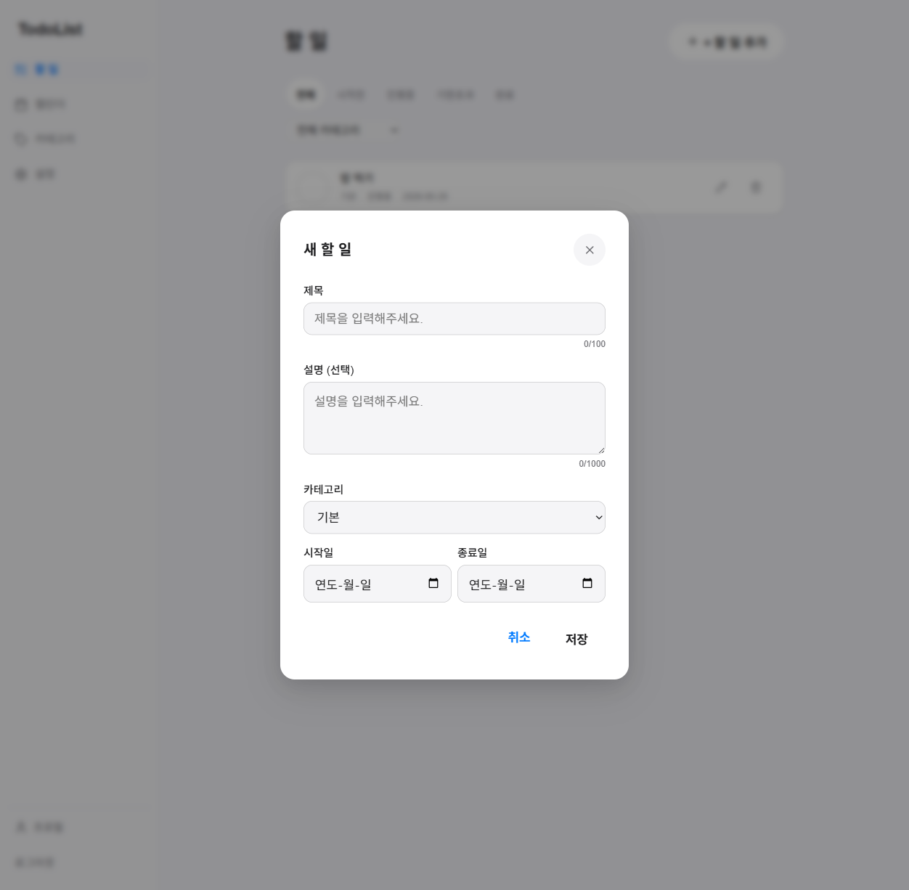
  - Todo added: 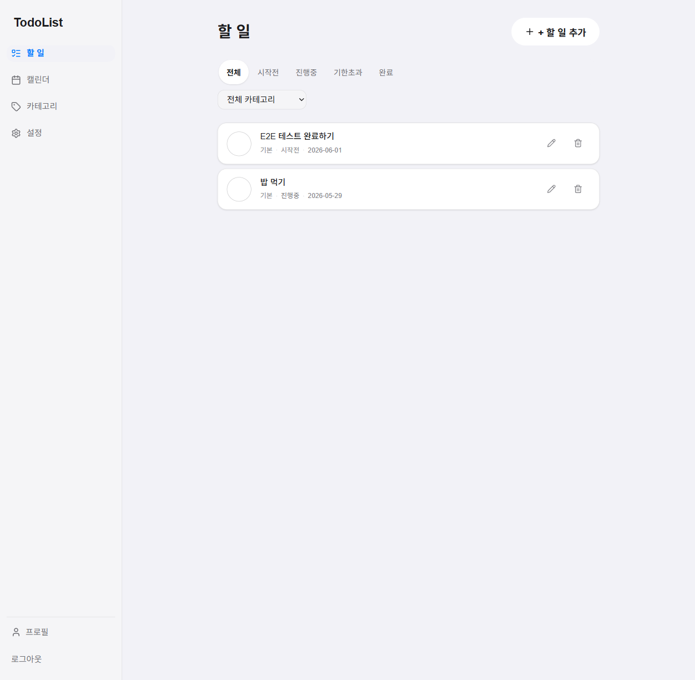

### 2. Edit Todo
- **Description:** Edit an existing todo's title.
- **Steps:**
  1. Click "수정" button on the created todo.
  2. Change title to "E2E 테스트 완료하기 (수정됨)".
  3. Click "저장".
- **Result:** Pass. Title updated correctly.
- **Screenshots:**
  - Todo edited: 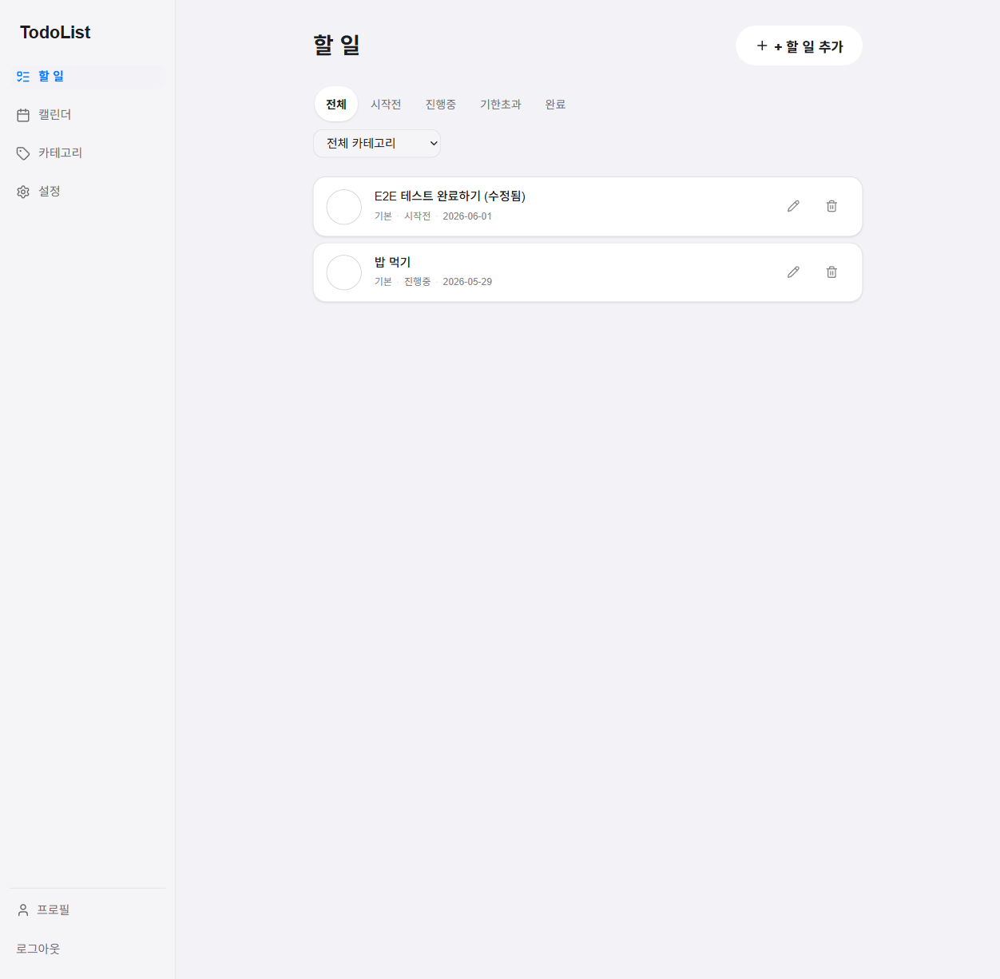

### 3. Delete Todo
- **Description:** Delete a todo item and verify removal.
- **Steps:**
  1. Click "삭제" button on the todo.
  2. Confirm deletion in the browser dialog.
- **Result:** Pass. Todo removed from the list.
- **Screenshots:**
  - Todo deleted: 

### 4. Category Management
- **Description:** Add a new category and verify it appears in the list and todo creation dropdown.
- **Steps:**
  1. Navigate to "카테고리" page.
  2. Click "카테고리 추가".
  3. Enter "운동" and click "추가".
- **Result:** Pass. Category added and visible.
- **Screenshots:**
  - Category list: 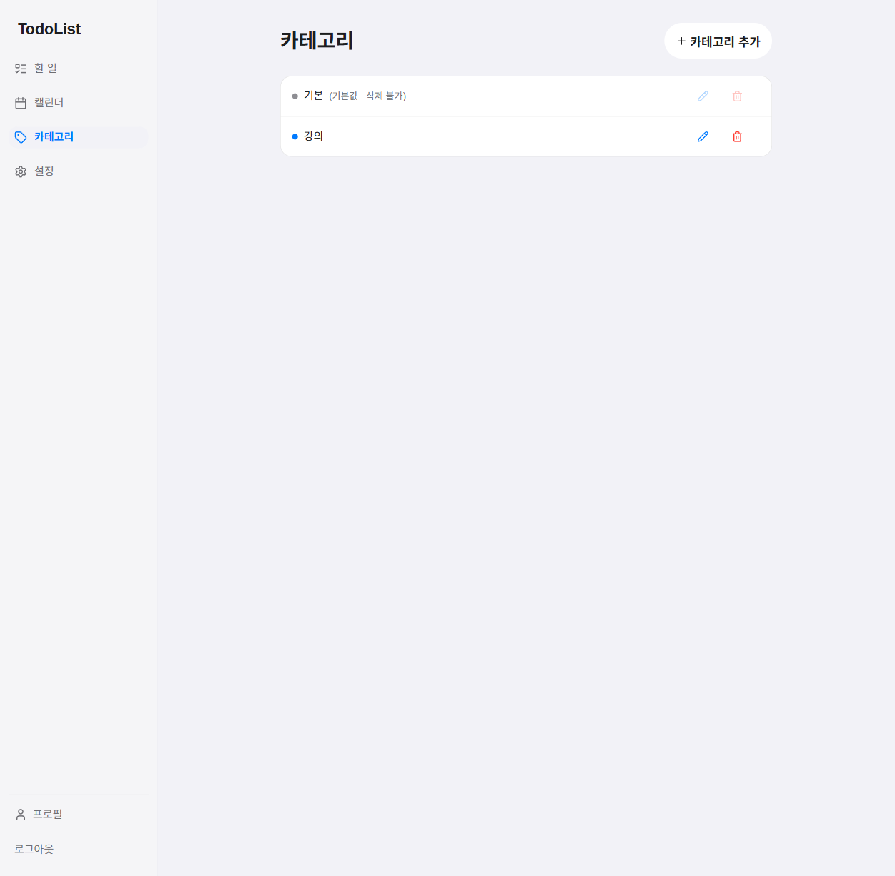
  - Category added: 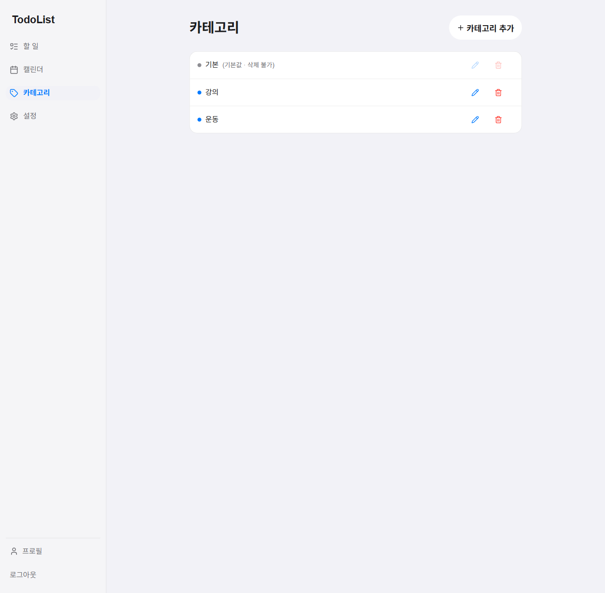

### 5. Filtering
- **Description:** Test status filters.
- **Steps:**
  1. Click "진행중" filter.
- **Result:** Pass. List filtered to show only "진행중" items.
- **Screenshots:**
  - Filtered list: 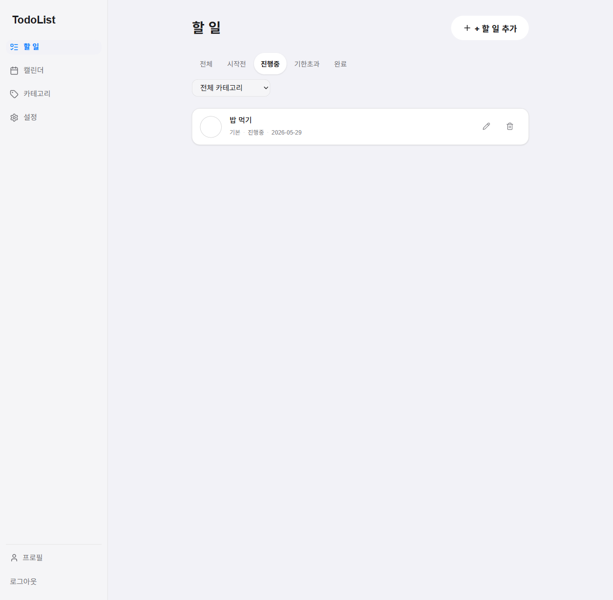

### 6. Edge Case: Empty Title
- **Description:** Try to add a todo without a title.
- **Steps:**
  1. Open "Add Todo" modal.
  2. Click "저장" without entering a title.
- **Result:** Pass. Validation error "필수 입력 항목입니다." displayed.
- **Screenshots:**
  - Error message: 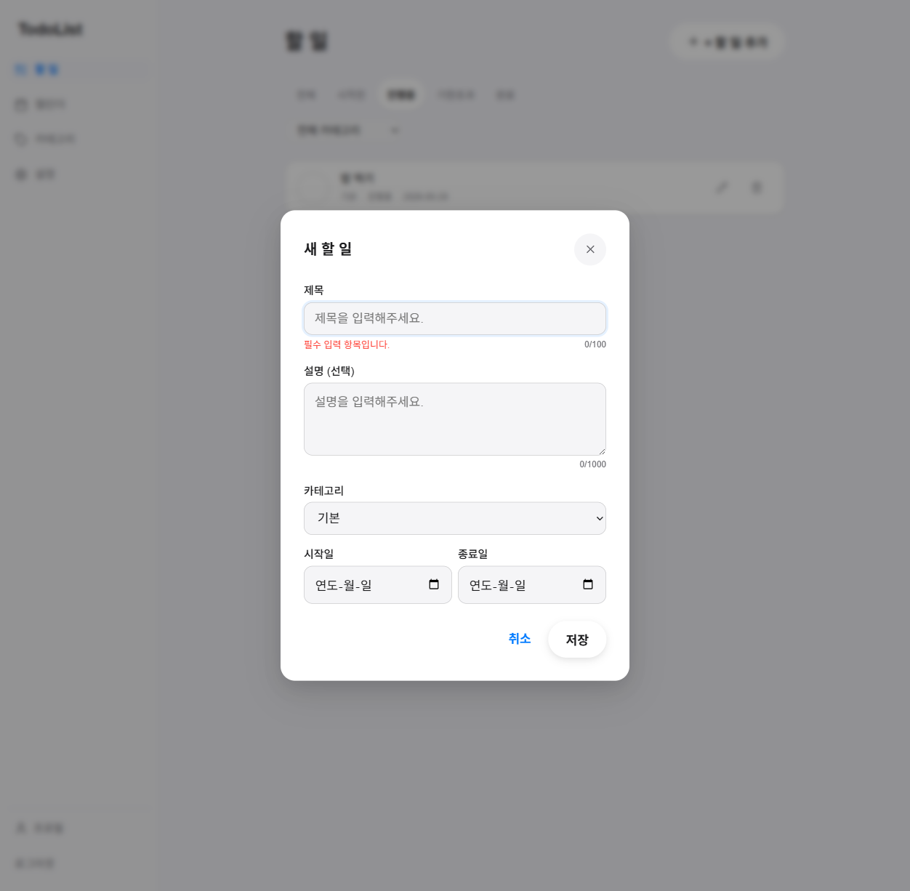

### 7. UI Fix: Redundant '+' Icon
- **Description:** Remove the extra '+' icon from the "Add Todo" button.
- **Problem:** The button displayed two '+' icons (one from the Lucide component and one from the translation text).
- **Fix:** Removed the '+' prefix from `todos.add` and `todos.addFirst` in translation files (`ko.json`, `en.json`).
- **Result:** Pass. Only one icon is displayed.
- **Screenshots:**
  - Fixed button: 

### 8. UI Enhancement: Completion Icon Size (Context-Specific)
- **Description:** Optimized the size of the completion checkmark ('V') and circle based on user preference and view context.
- **Problem:** The main todo list required better visibility (large V), while the calendar view was preferred to stay original/compact.
- **Fix:** 
    - **Main Todo List (`TodoCard`):** Enlarged the circle to `22px` and the checkmark icon to size `14` (stroke `3.5`).
    - **Calendar Detail List (`DayDetail`):** Reverted the circle and icon exactly to their original small state (`14px` circle, size `8` icon).
- **Result:** Pass. The UI now respects the user's specific preference for size variation across different contexts.
- **Screenshots:**
  - Large checkmark (Main Todo List): 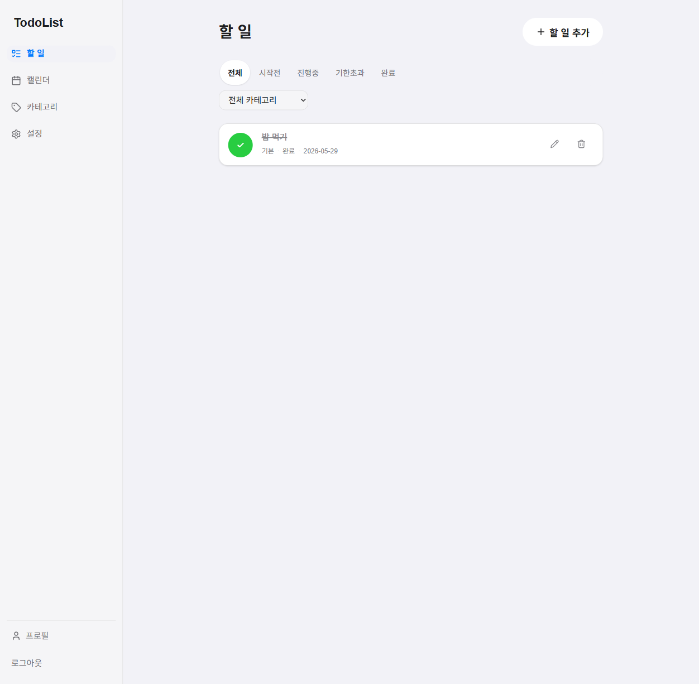
  - Small checkmark (Calendar Detail): 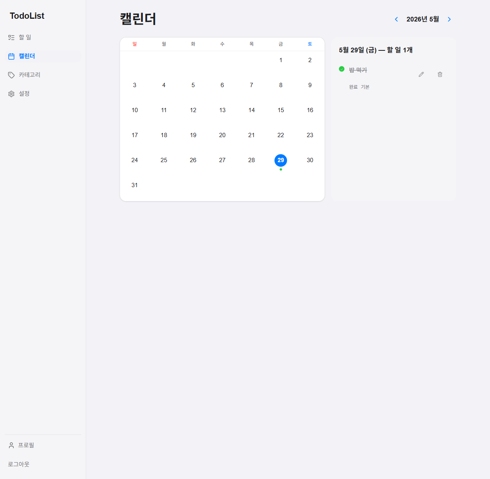

### 9. UI Alignment: Category Icons
- **Description:** Align category edit/delete icons with the todo list style.
- **Problem:** Category icons had different default colors and hover effects (background color) compared to the todo list.
- **Fix:** 
    - Updated default color to `var(--text-tertiary)`.
    - Updated hover colors to `var(--text-secondary)` (edit) and `var(--color-red)` (delete).
    - Removed hover background to match `TodoCard` style.
    - Standardized button size to 32x32px.
- **Result:** Pass. Visual consistency across the application is improved.
- **Screenshots:**
  - Aligned category icons: 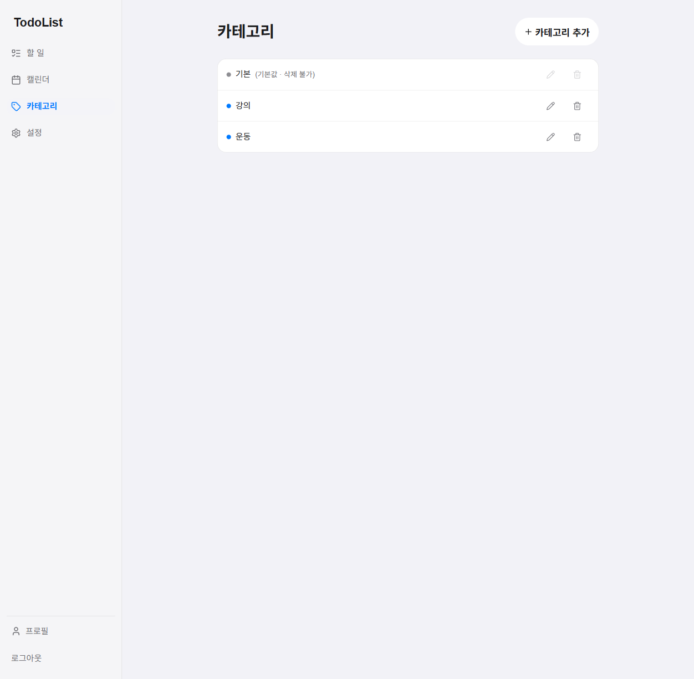

### 10. UI Alignment: Calendar Icons
- **Description:** Align calendar's todo list edit/delete icons with the main todo list style, while maintaining the original smaller completion button.
- **Problem:** Calendar's todo items used text buttons ("수정", "삭제") instead of icons.
- **Fix:** 
    - Replaced text buttons with `Pencil` and `Trash2` icons.
    - Standardized hover colors for icons: `var(--text-secondary)` (edit) and `var(--color-red)` (delete).
    - Maintained completion button at its original small size (`14px`) per user preference.
- **Result:** Pass. The calendar detail view now uses consistent icons while respecting preferred sizing for the completion toggle.
- **Screenshots:**
  - Aligned calendar icons: 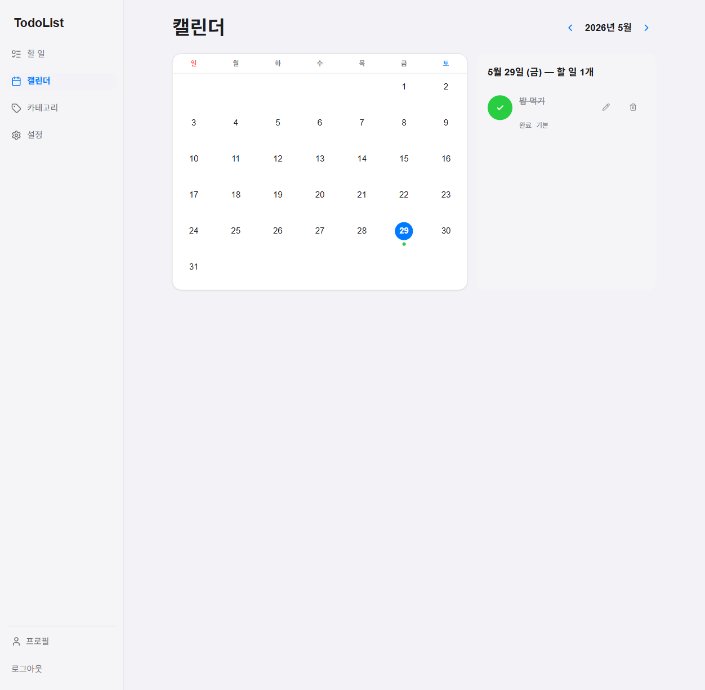

### 11. UI Refinement: Calendar Item Height & Alignment (Extreme Compact)
- **Description:** Optimized the vertical space, horizontal gap, and icon alignment in the calendar's todo list.
- **Problem:** The list felt disconnected with too much horizontal space between the icon and text, and vertical height could be further minimized.
- **Fix:** 
    - Reduced item vertical padding to `2px`.
    - Reduced the horizontal gap between the completion button and content from `12px` to `8px`.
    - Adjusted the separator line's `marginLeft` to `22px` to match the tighter spacing.
    - Maintained font and alignment optimizations from previous steps.
- **Result:** Pass. The calendar list items are now tightly grouped and vertically efficient, meeting the user's preference for a cohesive, compact look.
- **Screenshots:**
  - Tighter calendar list: 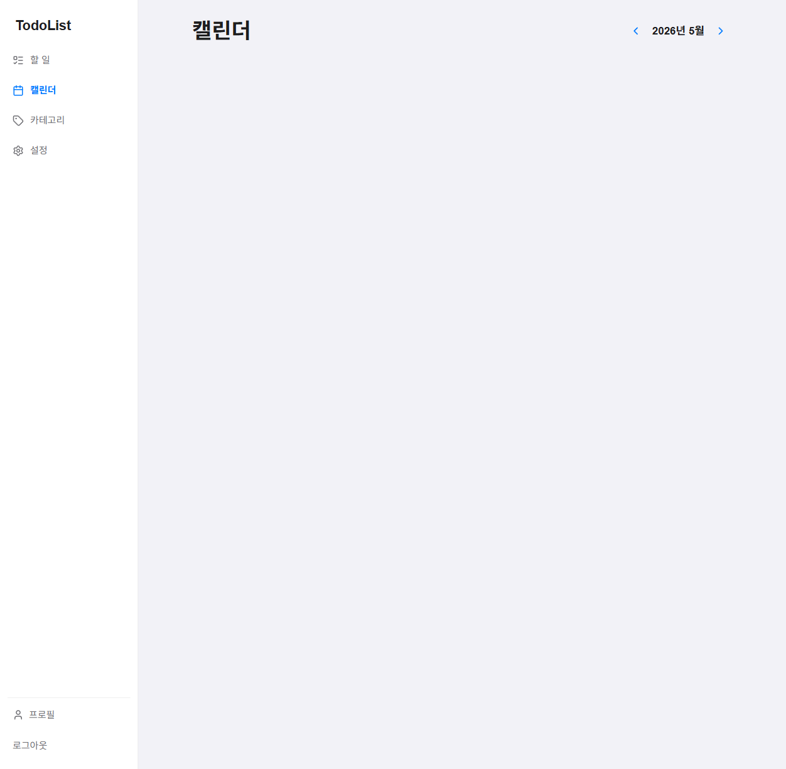

### 12. UI Refinement: Apple-style Sidebar Active State
- **Description:** Updated the active state of sidebar navigation items to reflect a modern, Apple-inspired design.
- **Problem:** The active sidebar item used a solid tertiary background that lacked premium visual polish.
- **Fix:** 
    - Changed the active background to `var(--fill-tinted)` (a soft, semi-transparent blue).
    - Explicitly set the active text and icon color to `var(--color-blue)`.
    - Enhanced the transition animation to use a smoother `cubic-bezier(0.4, 0, 0.2, 1)` curve over `200ms`.
- **Result:** Pass. The active navigation item now has a clean, premium highlight consistent with Apple's design language.
- **Screenshots:**
  - Apple-style sidebar: 

### 13. UI Text Update: Sidebar Title
- **Description:** Updated the generic "TodoList" title in the sidebar to a more localized and user-friendly name.
- **Problem:** The application name in the sidebar was hardcoded in English.
- **Fix:** 
    - Added an `appName` key to the translation files (`ko.json` as "나의 하루", `en.json` as "My Day").
    - Updated `AppLayout.tsx` to use the translated string via `t('common.appName')`.
- **Result:** Pass. The sidebar title now correctly displays "나의 하루" (or "My Day" based on language settings).
- **Screenshots:**
  - Translated sidebar title: 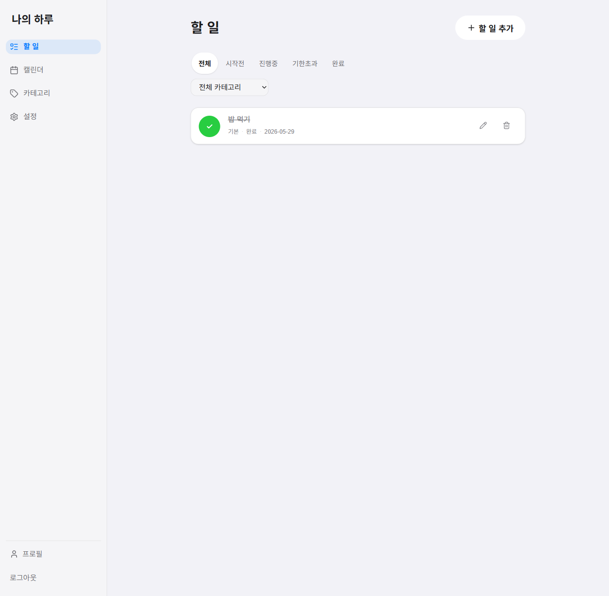

## Conclusion
All major functionalities were tested and are working as expected. The UI correctly handles validation and state changes.
